> eBPF是什么？
>
> 解决什么问题?
>
> 基于什么原理?
>
> 有什么限制?

external Barkley Package Filter, 例如tcpdump就是以BPF开发的应用.

eBPF能在内核中运行沙盒程序,而无需修改内核源码或者加载内核模块. Linux内核可编程以后, 就能基于现有的抽象层来打造更智能, 功能更丰富的基础设施软件, 并且不会增加系统的复杂度, 也不会牺牲执行效率和安全性．结构如下图：

基于此种方式，我们不仅能对内核进行编程，甚至还能编写跨多个子领域的处理逻辑．

典型应用模式如图示：

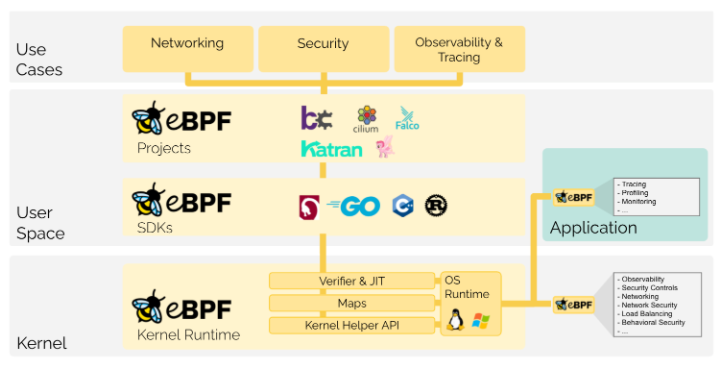

长期以往, 基于操作系统级别的创新很少, 然后操作系统级的应该具有更快速, 更高效, 摒弃了用户态和内核态的切换. eBPF提供了这样的能力. 开发人员可以运行eBPF程序以运行时向操作系统添加额外的功能. 然后操作系统保证了安全性和执行效率, 就像在JIT(及时编译器)和Verifier(验证引擎)的帮助下进行本地编译一样. 基于eBPF的项目覆盖了广泛的用例, 主要包括下一代网络, 可观察性和安全功能.

eBPF被广泛用于驱动各种用例, 包括高性能网络和负载均衡, 以极低的开销提取细粒度的可观察数据, 追踪应用程序, 提供性能故障排查, 预防性应用和容器运行时安全措施等.

## Hook

eBPF是事件驱动的, 并在内核或应用中通过某个挂钩运行. 预定义的Hood包括系统调用, 函数进入/退出, 内核跟踪点, 网络事件等.

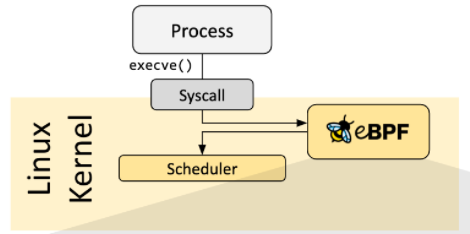

可以创建kprobe(内核探测器)或uprobe(用户探测器)以在内核或者用户应用的几乎任何地方附加eBPF程序.

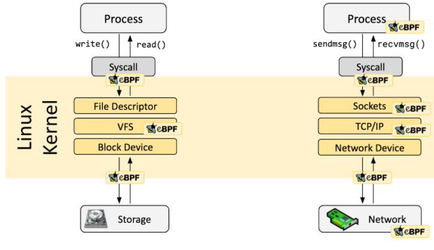

## 如何编写eBPF

一般情况, eBPF不是直接应用, 而是通过在其上封装的项目间接使用, 例如Cilium, bpftrace等. 通常不需要直接编写而是基于项目封装的接口进行调用.

如果不进行抽象, 则需要直接编写程序. Linux期望eBPF以字节码形式加载, 常见的是利用像LLVM这样的编译套件将C代码编译成eBPF字节码.

## Loader & Verification Architecture

当确定了需要的Hood以后, 可以使用bpf系统调用eBPF程序加载到Linux内核中. eBPF库提供了这样程序库. 介绍常用工具链.

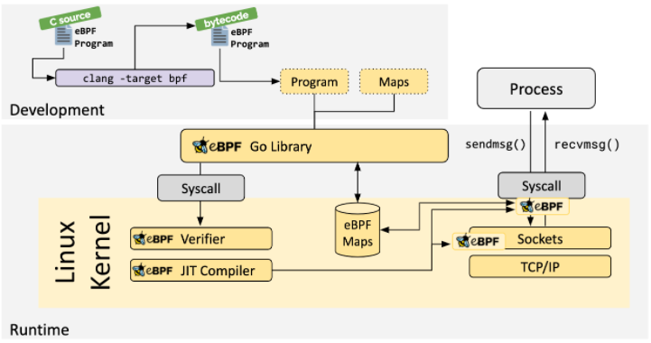

当程序被加载到Linux内核时, 在与请求的Hood进行关联时需要:

### Verifier

确保eBPF程序可以安全运行, 需要满足几个条件, 包括:

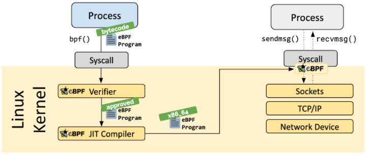

- 加载eBPF程序的进程拥有所需要的权限. -- 除非启用非特权eBPF, 否则只有特权进程才能加载eBPF程序.
- 该程序不会崩溃或损害系统.
- 程序总是运行到完成, 既不会无限死循环

### JIT

将程序的通用字节码转换为机器指令集, 以优化程序的执行速度. 这使得eBPF程序可以像本地编译的内核代码作为内核模块加载代码一样高效的运行.

### Map

eBPF程序的一个重要方面是共享收集的信息和存储状态能力. 为此, 程序可以利用eBPF映射的概念在广泛的数据结构集中存储和检索数据. eBPF映射可以通过系统调用从eBPF以及用户态中的应用程序访问. 

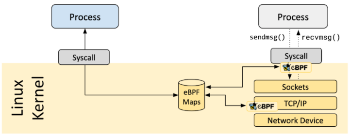

以下支持Map的数据类型部分列表:

- Hash tables, Arrays
- LRU (Least Recently Used)
- Ring Buffer
- Stack Trace
- LPM (Longest Prefix match)
- ...

### Helper Calls

eBPF程序不能调用任意内核函数. 否则会将eBPF程序绑定到特定的内核版本, 并使得程序的兼容性复杂化. 相反, eBPF程序可以将函数调用转化为辅助函数, 这是内核提供的众所周知且稳定的API.

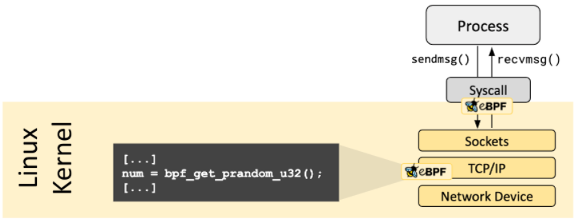

可以使用的帮助调用示例:

- 生成随机数
- 获取当前时间和日期
- eBPF Map访问
- 获取进程/cgroup 上下文
- 操作网络数据包和转发逻辑

### Tail & Function Calls

eBPF程序可以和Tail Function Calls组合在一起, 函数调用允许在eBPF程序中定义和调用函数. 尾调用可以调用和执行另一个eBPF程序并替换执行上下文. 类似于execve()系统调用对常规进程的操作方式.

### eBPF安全

*权力越大，责任也越大。*

eBPF是一项非常强大的技术, 并且在许多关键软件基础设施组件的核心云心. 在eBPF的开发过程中, eBPF的安全性是考虑将eBPF纳入Linux内核时的最关键因素. eBPF的安全性是通过以下几个层面来保证的:

#### 所需权限

除非启用非特权 eBPF，否则所有打算将 eBPF 程序加载到 Linux 内核的进程必须在特权模式（root）下运行或需要CAP_BPF能力。这意味着不受信任的程序无法加载 eBPF 程序。

如果启用了非特权 eBPF，非特权进程可以加载某些 eBPF 程序，这些程序受限制的功能集和对内核的访问受限。

#### 验证者

如果允许进程加载 eBPF 程序，则所有程序仍会通过 eBPF 验证器。eBPF 验证器确保程序本身的安全性。这意味着，例如：

- 程序经过验证以确保它们始终运行到完成，例如 eBPF 程序可能永远不会阻塞或永远处于循环中。eBPF 程序可能包含所谓的有界循环，但只有当验证者可以确保循环包含保证变为真的退出条件时，才会接受该程序。
- 程序不得使用任何未初始化的变量或越界访问内存。
- 程序必须符合系统的大小要求。无法加载任意大的 eBPF 程序。
- 程序必须具有有限的复杂性。验证者将评估所有可能的执行路径，并且必须能够在配置的复杂性上限的范围内完成分析。

#### 固化

在成功完成验证后，eBPF 程序会根据程序是从特权进程还是非特权进程加载来运行一个加固过程。这一步包括：

- **程序执行保护：**保存 eBPF 程序的内核内存受到保护并设为只读。如果出于任何原因，无论是内核错误还是恶意操作，尝试修改 eBPF 程序，内核将崩溃，而不是允许它继续执行损坏/被操作的程序。
- **对 Spectre 的缓存：**在推测下，CPU 可能会错误预测分支并留下可以通过侧信道提取的可观察到的副作用。举几个例子：eBPF 程序屏蔽内存访问，以便在瞬态指令下将访问重定向到受控区域，验证器还遵循只能在推测执行下访问的程序路径，并且 JIT 编译器发出 Retpolines 以防尾调用无法转换为直接调用.
- **常量盲区：**代码中的所有常量都是盲区，以防止 JIT 喷射攻击。这可以防止攻击者将可执行代码作为常量注入，在存在另一个内核错误的情况下，可能允许攻击者跳入 eBPF 程序的内存部分以执行代码。

### 抽象的运行时上下文

eBPF 程序不能直接访问任意内核内存。必须通过 eBPF 帮助程序访问位于程序上下文之外的数据和数据结构。这保证了数据访问的一致性，并使任何此类访问都受制于 eBPF 程序的权限，例如，如果可以保证修改是安全的，则允许运行的 eBPF 程序修改某些数据结构的数据。eBPF 程序不能随意修改内核中的数据结构。

## 为什么是eBPF

### 可编程性的力量

以网页举例, 20年前的网页几乎都是静态的, 以HTML编写. 但是今天的网页呢, 基于SaaS开放的, 网页几乎可以做所有的事情, 包括复杂的游戏. 这个是什么带来的? 答案是的JavaScript的可编程性. 

在将这个例子应用到 eBPF 之前，让我们看一下在引入 JavaScript 中至关重要的几个关键方面：

- **安全性：**不受信任的代码在用户的浏览器中运行。这是通过沙箱 JavaScript 程序和抽象访问浏览器数据来解决的。
- **持续交付：**程序逻辑的演进必须是可能的，而无需不断地发布新的浏览器版本。这是通过提供足以构建任意逻辑的正确低级构建块来解决的。
- **性能：**必须以最小的开销提供可编程性。通过引入即时 (JIT) 编译器解决了这个问题。

### eBPF 对 Linux 内核的影响

现在让我们回到 eBPF。为了理解 eBPF 对 Linux 内核的可编程性影响，它有助于对 Linux 内核的架构以及它如何与应用程序和硬件交互有一个高层次的理解。

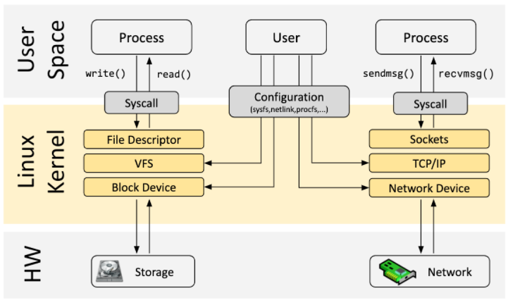

Linux的内核的主要目的是抽象硬件或者虚拟硬件, 并提供一致的API, 允许应用程序运行和共享资源. 为了实现这个目的, 维护了大量的子系统和抽象来分配这些职责. 每个子系统通常允许某种级别的配置来满足用户的不同需求. 如果无法配置所需的行为, 则需要更改内核. 

eBPF提供了一个新选项, 允许重新编程Linux内核的行为, 并且无需更改内核源代码或加载内核模块. 

## 常见工具链

### BCC

BCC 是一个框架，它使用户能够编写嵌入其中的 eBPF 程序的 Python 程序。该框架主要针对涉及应用程序和系统分析/跟踪的用例，其中 eBPF 程序用于收集统计信息或生成事件，用户空间中的对应方收集数据并以人类可读的形式显示。运行 python 程序将生成 eBPF 字节码并将其加载到内核中。

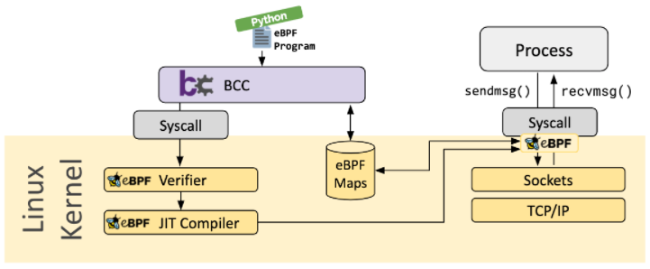

### bpftrace

bpftrace 是一种用于 Linux eBPF 的高级跟踪语言，可在最近的 Linux 内核 (4.x) 中使用。bpftrace 使用 LLVM 作为后端将脚本编译为 eBPF 字节码，并利用 BCC 与 Linux eBPF 子系统以及现有的 Linux 跟踪功能进行交互：内核动态跟踪 (kprobes)、用户级动态跟踪 (uprobes) 和跟踪点. bpftrace 语言的灵感来自 awk、C 和前身跟踪器，例如 DTrace 和 SystemTap。

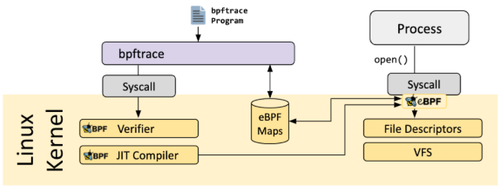

### eBPF Go Library

eBPF Go library提供了一个通用的 eBPF 库，它将获取 eBPF 字节码的过程与 eBPF 程序的加载和管理解耦。eBPF 程序通常是通过编写高级语言创建的，然后使用 clang/LLVM 编译器编译为 eBPF 字节码。

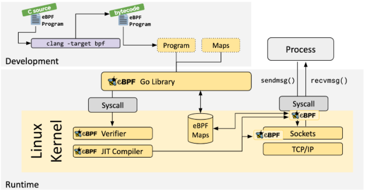

### libbpf C/C++ Library

是一个基于 C/C++ 的通用 eBPF 库，它有助于将从 clang/LLVM 编译器生成的 eBPF 目标文件加载到内核中，并通过提供易于使用的库 API 来抽象与 BPF 系统调用的交互应用程序。

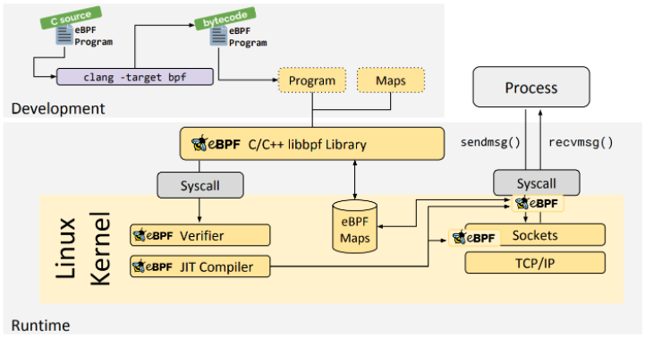