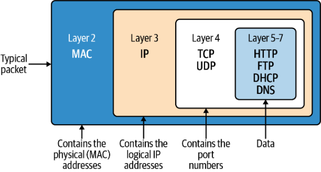
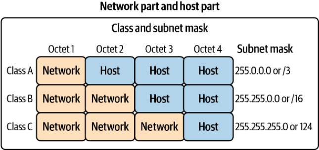

# 网络基础

在OSI网络模型中，每一层使用不同的数据格式封装不同的内容。数据封装如下：

| Layer | Name         | Data Unit         | Function                                                     |
| ----- | ------------ | ----------------- | ------------------------------------------------------------ |
| 7     | Application  | Data              | 高级 API 和应用程序协议，如 HTTP、DNS 和 SSH。               |
| 6     | Presentation | Data              | 字符编码、数据压缩和加密/解密。                              |
| 5     | Session      | Data              | 节点之间的连续数据交换在这里进行管理：发送多少数据，何时发送更多数据。 |
| 4     | Transport    | Segment, datagram | 在网络端点之间传输数据段，包括分段、确认和多路复用。         |
| 3     | Network      | Packet            | 为网络上的所有端点构建和管理寻址、路由和流量控制。           |
| 2     | Data Link    | Frame             | 在物理层连接的两个节点之间传输数据帧。                       |
| 1     | Physical     | Bit               | 通过媒体发送和接收比特流。                                   |

总体数据封装如下：



另外通过网段划分来进行局域网的设置，这个和Kubernetes网络设定一致。



# Linux网络

## 网络接口

通过物理或者虚拟网络接口与外部进行通讯。典型的IP地址分配给网络接口，Linux本身有网络接口概念，使用`ifconfig`可以看到配置的网络接口的信息。
特殊的127.0.0.1是标准的环回接口。发送到环回接口的，不会离开主机本身。监听127.0.0.1的，只能接受到本机的进程的数据。通常可能遇到通过`netstat`命令查看到监听地址为127.0.0.1的某个端口，意味着无法响应主机外部来的接口。

## 桥接

桥接：在单个主机上建立多个2层网络，就像是主机上的的网络之间的交换机。桥接允许POD与其各自的网络接口通信，并且通过节点的网络接口与外部通信。


veth-pair是成对出现的，彼此相互连接，另外两侧连接到各自协议栈，如下图


 例如：创建两个网络命名空间，以及两个veth。两个命名空间与veth相连，veth再各自连接，网络命名空间就各自ping通了。

```shell
# ip netns add net1
# ip netns add net2
# ip link add veth1 netns net1 type veth peer name veth2 netns net2
```

## 内核中的数据包处理

Linux内核负责在数据包之间进行转换，包括mac地址，ip地址，端口等。

### Netfilter

从内核2.3开始，Netfilter作为一个数据包处理的关键组件。它提供了一个内核钩子框架，它允许用户空间程序代表内核处理数据包。简而言之，程序注册到特定的 Netfilter 钩子，内核在适用的数据包上调用该程序。该程序可以告诉内核对数据包做一些事情（比如丢弃它），或者它可以将修改后的数据包发送回内核。有了这个，开发人员可以构建在用户空间中运行并处理数据包的普通程序。Netfilter 是与`iptables`,联合创建的，用于分离内核和用户空间代码。Netfilter钩子与iptables的*chains*概念做映射。具体的网络钩子如下：

| 钩子               | iptables chain 名称 | 描述                                                         |
| ------------------ | ------------------- | ------------------------------------------------------------ |
| NF_IP_PRE_ROUTING  | PREROUTING          | 当数据包从外部系统到达时触发。                               |
| NF_IP_LOCAL_IN     | INPUT               | 当数据包的目标 IP 地址与本机匹配时触发。                     |
| NF_IP_FORWARD      | NAT                 | 触发源和目标都与机器的 IP 地址都不匹配的数据包（换句话说，这台机器代表其他机器路由的数据包）。 |
| NF_IP_LOCAL_OUT    | OUTPUT              | 当来自机器的数据包离开机器时触发。                           |
| NF_IP_POST_ROUTING | POSTROUTING         | 当任何数据包（无论来源）离开机器时触发。                     |

典型的数据流处理流程如下：


针对满足条件的所有钩子，可以执行多种操作：

- *Accept*

  继续数据包处理。

- *Drop*

  丢弃数据包，无需进一步处理。

- *Queue*

  将数据包传递给用户空间程序。

- *Stolen*

  不执行进一步的钩子，并允许用户空间程序获得数据包的所有权。

- *Repeat*

  使数据包“重新进入”钩子并重新处理。

### Conntrack

Conntrack 是一个 Netfilter 的组件，用于跟踪进出机器的连接状态。连接跟踪直接将数据包与特定连接相关联。如果没有连接跟踪，数据包流将更加不透明。可以认为是在Netfilter的操作的一种抽象。

NAT是依赖于Conntrack来运行，iptables暴露的NAT分为两种，SNAT（源地址转换）和DNAT（目标地址转换）。

Conntrack连接元数据包括：源地址，源端口，目的地址，目的端口以及L4协议组成。元数据识别了任意L4连接的最小信息。在Conntrack中，这些连接被称之为流。

Conntrack存储中，将元数据作为hash算法的key，具体什么作用待查。 存储空间大小影响了性能，以及消耗。

### Route

处理任何数据包，必须决定将数据发往何处。发送地址通过配置的路由表来决定应该发往何处。

一些网络插件大量使用路由表。Linux具有更复杂的数据包管理工具，这些工具允许创建防火墙、记录流量、数据包路由、甚至是实现负载均衡。K8S也使用部分这些工具，最常见的工具包括：`iptables`，`kube-proxy`。

### iptables

iptables已经存在很多年，可以用于创建防火墙，审计，重新路由，甚至简单的扇出等，`iptables`使用Netfilter，允许拦截和改变数据包。iptables规则叫复杂，提供了部分 简单的工具进行操作，例如uwf和firewalld等。

------

**tips**

大多数 Linux 发行版正在替换`iptables`为`nftables`，这是一种类似但性能更高的工具，它构建在 Netfilter 之上。一些发行版已经附带了`nftables`.

Kubernetes 有 `iptables`/`nftables`转换的许多已知问题。我们强烈建议在可预见的未来不要使用 `nftables`支持的版本`iptables`。

------

#### `iptables`

有三个概念：表、链、规则。表包含链，链包含规则。

tables映射到具体的目标对象，每个表负责特定的操作。

| 表名     | 目的                                                         |
| -------- | ------------------------------------------------------------ |
| Filter   | 处理数据包的接受和拒绝。                                     |
| NAT      | 用于修改源或目标 IP 地址。                                   |
| Mangle   | 可以对数据包头执行通用编辑，但它不适用于 NAT。它还可以使用`iptables`仅元数据“标记”数据包。 |
| Raw      | 原始表允许在处理连接跟踪和其他表之前进行数据包突变。它最常见的用途是禁用某些数据包的连接跟踪。 |
| Security | SELinux 使用安全表来处理数据包。它不适用于未使用 SELinux 的机器。 |

#### `chains`

是一个规则列表。当一个数据包通过一个chain时，每个规则都会被顺序评估。每个链对应Netfilter的钩子，直到数据包匹配一个终止目标（`DROP`），或者到达链路的末端。

| chains      | Netfilter hook     |
| ----------- | ------------------ |
| PREROUTING  | NF_IP_PRE_ROUTING  |
| INPUT       | NF_IP_LOCAL_IN     |
| NAT         | NF_IP_FORWARD      |
| OUTPUT      | NF_IP_LOCAL_OUT    |
| POSTROUTING | NF_IP_POST_ROUTING |

chain并不是包含所有的表，表的执行顺序保持不变。执行顺序从左到右。表和链的关系如下：

|             | Raw  | Mangle | NAT  | Filter |
| ----------- | ---- | ------ | ---- | ------ |
| PREROUTING  | ✓    | ✓      | ✓    |        |
| INPUT       |      | ✓      | ✓    | ✓      |
| FORWARD     |      | ✓      |      | ✓      |
| OUTPUT      | ✓    | ✓      | ✓    | ✓      |
| POSTROUTING |      | ✓      | ✓    |        |

即表示，例如：当触发外部数据来时，会触发`PREROUTING`链，就可能会引起`Raw`，`Mangle`，`NAT`的更改。

数据包流程示意如下：


#### `Subchains`

在上述的顶层链中间，可以通过JUMP执行自己定义的子链。例如子链包含了一个NAT操作等。类似于我们通过自定义函数封装了系统提供的5个API.

#### `Rules`

规则包含两部分，条件和动作。如果匹配条件则执行定义的动作，如果不匹配就移动到下一个规则。

展示一些常见的匹配条件

| Match Type    | flag                      | comments                                                     |
| ------------- | ------------------------- | ------------------------------------------------------------ |
| Source        | -s,--src,--source         | 匹配指定源地址的数据包。                                     |
| Destination   | -d,--dest,--destination   | 将数据包与目标源地址进行匹配。                               |
| Protocol      | -p,--protocol             | 匹配指定协议的数据包。                                       |
| In interface  | -i,--in-interface         | 匹配通过指定接口进入的数据包。                               |
| Out interface | -o,--out-interface        | 匹配离开指定接口的数据包。                                   |
| State         | -m state --state <states> | 匹配来自处于逗号分隔状态之一的连接的数据包。Conntrack 状态（NEW、ESTABLISHED、RELATED、INVALID）。 |

常见的目标类型和行为

| 目标类型   | 适用表 | 描述                                                         |
| ---------- | ------ | ------------------------------------------------------------ |
| AUDIT      | All    | 记录有关接受、丢弃或拒绝的数据包的数据。                     |
| ACCEPT     | Filter | 允许数据包继续畅通无阻，无需进一步修改。                     |
| DNAT       | NAT    | 修改目标地址。                                               |
| DROPs      | Filter | 丢弃数据包。对于外部观察者来说，它看起来好像从未收到过数据包。 |
| JUMP       | All    | 执行另一个链。一旦该链完成执行，父链的执行将继续。           |
| LOG        | All    | 通过内核日志记录数据包内容。                                 |
| MARK       | All    | 为数据包设置一个特殊的整数，用作 Netfilter 的标识符。整数可用于其他`iptables`决策，不会写入数据包本身。 |
| MASQUERADE | NAT    | 修改数据包的源地址，将其替换为指定网络接口的地址。这类似于 SNAT，但不需要事先知道机器的 IP 地址。 |
| REJECT     | Filter | 丢弃数据包并发送拒绝原因。                                   |
| RETURN     | All    | 停止处理当前链（或子链）。请注意，这*不是*终止目标，如果存在父链，则将继续处理该链。 |
| SNAT       | NAT    | 修改数据包的源地址，将其替换为固定地址。另见：`MASQUERADE`。 |

### `IPVS`

IPVS是一个L4的负载均衡器，简单图解如下：


支持的均衡策略，rr，lc，dh，sh，sed，nq。

IPVS支持的数据包转发模式：NAT,DR，IP隧道。通过`ipset`进行hash保存，一个ip可以指定多个后端服务，每个IP可以匹配一个规则，不再像`iptables`一样需要顺序的检测每一个规则。每个服务生成的规则为8条，避免的服务多了以后，呈指数级的数据更新和规则路由。

### eBPF

是一种编程，允许特殊沙盒程序在内核中运行而无需再内核和用户态之间来回传递的系统。例如`tcpdump`就是BFP的一种用例。eBPF可以直接访问系统调用，而无需向用户空间添加内核挂钩常用的方法。eBPF在内核4.08以后启用。

支持的挂载点除了socket以外还包括：

- *Kprobes*

  内部内核组件的动态内核跟踪。

- *Uprobes*

  用户空间跟踪。

- *Tracepoints*

  内核静态跟踪。这些由开发人员编程到内核中，与 kprobes 相比更稳定，kprobes 可能会在内核版本之间发生变化。

- *perf_events*

  数据和事件的定时采样。

- *XDP*

  专门的 eBPF 程序可以低于内核空间来访问驱动程序空间以直接对数据包进行操作。

-------------------

# 容器网络

我们每个容器都有使用`cgroup`和`namespace`。`cgroup`控制容器对内核中资源的访问，`namespace`则是单独的资源隔离，与根命名空间分开管理。


`cgroup`可以控制的资源包括：CPU, MEM，IO, Network.

`namespace`可以虚拟化空间有PID, Network, IPC, mount, UTS, UID

## 容器网络基础

以Docker为例，列举容器网络使用模式，差异，特点。并解释容器之间如何通信，以及容器如何与外部通信。

使用的网络模式如下列：

- none

  容器不需要网络访问

- bridge

  容器运行在主机内部的私有网络。与网络中的其他容器网络是开放的。如果要与外部通信在离开主机之前使用NAT。默认的联网方式

- host

  容器与主机共享相同的IP地址和网络命名空间。容器中的进程与在主机上直接运行的服务具有相同的网络功能。意味着，与主机是互通的，容器本身可以不关注。 失去了网络分段，需要处理与主机的冲突。并仅仅适用于Linux。

- Macvlan

  Macvlan使用主机网络模拟出内部的网络连接。Macvlan网络彼此分段，提供网络内的访问。外部网络无法访问内部的mac地址。允许一个物理设备使用多个MAC和IP。有四种类型Private、VEPA、Bridge（Docker 默认使用）和 Passthrough。对于bridge，使用NAT进行外部连接。

- IPvlan

  与Macvlan类似，仅仅是不会创建新的MAC地址。IPVlan可以工作在L2或者L3。

- overlay

  允许跨容器集群中的主机扩展同一个扁平化网络。让所有集群中的容器，看起来都像是在同一个网络里面。

- custom

  与bridge相同，但是需要显示的创建网桥。

Docker的网络，都由通过连接的veth-pair，一端连接到container，一端连接到Docker bridge。如下提：


Bridge仅仅作用于运行在同一个主机的容器。运行在不同主机的容器如何进行通信呢？我们可以使用Overlay。Docker使用本地和全局驱动的概念，在本机使用Bridge，跨主机，使用Overlay。全局依赖于第三方存储来进行跨主机系诶套。例如：etcd等。

## Overlay网络

要使容器进行跨网络通信需要解决一下问题：如何协调主机的路由信息、端口冲突、IP地址管理。VXLAN是一种容器主机之间的路由技术。

VXLAN是VLAN的扩展，VXLAN创建了1600万个唯一标识符。在物理网路上的传输协议是IP和UDP。VXLAN定义了MAC-in-UDP的封装方案。VXLAN数据包是经过MAC-in-UDP封装了的数据包。添加了表头，表头是24位的，因此是可以支持1600网个网络。 UDP封包，意味着数据可能丢包。

VXLAN的隧道断点VTEP位于两个主机，分别通过隧道连接到主机的桥接接口。VTEP执行封装和解封。

如图示：


## underlay网络

与overlay网络对应的，underlay一般指物理基础设施。在容器网络中的underlay网络指借助驱动程序将主机的底层网络直接暴露给容器使用的技术。比如MACVlan，IPvlan，直接路由等。


检查容器网络模型。 CNM包含其他问题，与K8S并不兼容，因此出现了从CoreOS开始的CNI项目。

## Container Network Interface

是容器运行时和网络实现直接的接口。CNI通过在容器创建时分配资源，删除时清除资源。CNI还负责将网络接口与容器网络命名空间的关联，并且为新增的接口分配IP，并设置路由。

架构如下：


------


# Kubernetes网络

Kubernetes网络主要解决4个问题：

- Pod内部的容器通信
- Pod到Pod的通信
- Pod到服务的通信
- 外部到服务的通信

Docker默认使用网桥，是基于主机的，容器的IP被分配了一个私有IP地址，意味着在不同的主机上不能进行相互通信。因此Docker需要将容器端口与主机端口进行映射，然后进行通信。

## Kubernetes网络模型

K8S的网络模型支持多主机集群网络，默认情况，Pod可以相互通信，而不同管Pod部署在哪个主机。因此CNI项目需要满足一下需求：

- 容器必须在没有NAT的情况下相互通信
- 主机可以在没有NAT情况下相互通信
- 容器IP可以与外部的IP相同

为了满足上诉需求，面临着一下几个问题：

- 不同的服务竞争不同的端口怎么办，有些服务甚至是无法改变端口。
  - pod分配不同的ip，端口也互不影响
- 每个Pod的生命是短暂的，每个新的Pod的名称，IP，进程号，挂载磁盘等等，都是不一样的。如何访问到指定的Pod
  - 手动指定DNS，或手动配置路由
  - 创建Pod时，显式指定IP

每个Node都运行一个kubelet的服务，它负责管理节点上的Pod。实现的网络功能在于kubelet跟各自节点上的CNI插件API进行交互。

- 管理Pod IP地址
- 单个容器网络配置
- 分配Pod IP，维护路由

## Node和Pod网络布局

集群必须拥有一组受控制的IP地址，以便Pod分配IP。例如，`10.1.0.0/16`，那么所有的Pod的IP均在此网段。一般来说Pod没有MAC地址。主机之间必须具有L3的连接，既Node的IP互通。集群内的Pod对外部网络连接时需要受控的，因此通常还需要单独定义Ingress以及Engress。集群网络隔离大致分为三类：

- ## Isolated Networks

  孤立的网络集群，节点与外网是可达的，但是Pod不可达。Pod无法访问集群外的Pod。

  集群之间完全独立，可以使用相同的Pod IP，名称等。

  

- ## Flat Networks

  在平面网络，所有的Pod都包含一个可以从外部可达的路由IP。整个网络上的任何主机都可以路由到集群内部的或者外部的任何Pod。这种网络的复杂度和性能方面都有许多优点。

  由于Pod的IP路由可达，因此每个Pod的IP不可重复。 并且结合服务发现，均衡可以决定由哪个Pod接收这些数据，既针对Pod的直接负载均衡。指向特定的Pod IP减少了中间的封包，拆包，减少了域名解析，因此延迟和开销都有所优化。

  带来的缺点：集群之间的Pod IP管理变得复杂，并且IP的资源是有限的。并且需要将私有的IP以NAT的方式发布到运行网络。另外对于IP分配管理需要特意的定制。

  

  

- ## Island Networks

独立网络和扁平网络的集合，进出Pod的流量需要经过代理。大多数情况是通过`iptables`对离开节点的Pod数据包的SNAT实现，称之为*masquerading*，它将Pod地址重写为Node地址，从外部看，此包数据来源于Node而不是Pod。共享一个IP一个隐藏一个IP，在集群中，哪个IP是Pod IP，哪个IP是外部IP是很明显的。是否还记得安装时对Pod以及service做的网络规划。

K8S网络分为控制平面和数据平面，其中控制平面指使用哪条路径发送数据。数据平面指将数据包从一个接口转发到另一个接口。


K8S使用kube-controller-manager进行管理配置。其中配置了集群的CIDR。

kubelet充当了协调器，主要实现了容器网络管理（CNI）和容器运行时（CRI）。当收到schedule下发的任务时，kubelet通过与API的交互，完成对Pod状态的具体更改。

kubelet必须能够连接到Kubernetes API Server，如下的连接交互图：

- *CNI*

  使网络能够获取Pod和Service的IP

- gRPC

  API Server到etcd的访问协议

- *Kubelet*

  确保分配在主机上的Pod都能够达到期望的状态

- *CRI*

  允许kubelet云容器运行时进行对话，允许操作容器运行时的API，例如：启动容器

  

### CNI规范

CNI插件必须要支持的4种操作：

- ADD

  将容器添加到网络

- DEL

  从网络中删除一个容器

- CHECK

  如果容器的网络有问题，则返回错误

- VERSION

  报告有关插件的版本信息

Kubernetes一次只允许使用一个插件（某一个主类），但是插件允许多个设置，现在多个插件允许了跟其他插件共同工作的可能。

例如CNI配置：


### CNI插件

包含两个功能：为Pod和Service分配唯一IP；确保Pod IP可达的路由。

管理IP的策略，以及网络架构影响了CNI插件的行为，因此需要根据实际的业务选择适合的网络插件。

网络类型的两大类：flat和overlay。 在flat中整个集群使用同一个网络范围。 在overlay中，在集群内共享了辅助网络，它使用集群的网络基础设施发送数据包。

### IPAM接口

用于具体具体的IP地址，网关，路由的分配设置。

## 流行的网络插件

流行的插件列表如下，此列表不是所有网络插件的全部，仅仅是使用量比较多，特点比较明显的几个。

| 名称      | 支持网络策略 | 数据存储               | 网络设置                     |
| --------- | ------------ | ---------------------- | ---------------------------- |
| Cilium    | Yes          | etcd or consul         | Ipvlan(beta), veth, L7 aware |
| Flannel   | No           | etcd                   | Layer 3 IPv4 overlay network |
| Calico    | Yes          | etcd or Kubernetes API | Layer 3 network using BGP    |
| Weave Net | Yes          | None                   | Mesh overlay network         |

后续将有具体组件的说明介绍。

## kube-proxy

同样node的守护进程，负责在集群内部负责基本的负责均衡，依赖于Service，Endpoint和EndpointSlices。

- Service为一组Pod定义了一个负载均衡器
- Endpoint和EndpointSlices列出一组准备好的Pod IP。

大多数服务有一个服务地址，称之为集群IP，在集群外不可路由。kube-proxy负责将请求路由到服务的IP，再到Pod。部分CNI组件提供了kube-proxy的替代功能。

kube-proxy拥有4个模式，userspace，iptables，ipvs，kernelspace。所有模式都对iptables有一定的依赖。

### userspace

基本以不再常用。

### iptables

最常用，也是默认采用的模式。

参看现有服务使用的iptables规则，例如：将33%的消息路由至PodA，在余下的50%的路由至PodB，剩余的全部路由至PodC。

既满足了大约每个Pod1/3的路由要求。

### ipvs

支持多种路由策略，如Linux网络中说明的一样。

### kernelspace

仅适用于windows，略过

## 网络策略

Kubernetes默认设置是允许集群网络中的所有流量。在实践中，这种策略存在一定的风险，并不可取。

网络策略是包含Pod选择器，入口规则，出口规则的定义。既表明哪些Pod允许访问哪些资源。

## 域名系统

DNS是一个任何网络的关键基础设施。KubeDNS（早期），CoreDNS通过访问API Server完成对Service的域名解析。

常见的配置：

*Default*

Pod从主机继承名称解析配置

*ClusterFirst*

任何与集群域后缀不匹配的DNS查询。例如：默认的集域名为：cluster.local，因此www.td-tech.com的数据都会发往主机的DNS进行解析。

*ClusterFirstWithHostNet*

如果Pod使用的是hostNetwork，将使用此策略

*None*

所有DNS设置都使用Pod中dnsConfig的配置


## 总结

Kubernetes 网络模型是网络设计如何在集群内工作的基础。在节点上运行的 CNI 实现了 Kubernetes 网络模型中规定的原则。该模型没有定义网络安全；Kubernetes 的可扩展性允许 CNI 通过网络策略实现网络安全。

CNI、DNS、网络安全是集群网络必不可少的组成部分；它们桥接Linux网络，覆盖在之间的间隙，和容器和Kubernetes联网。

选择 正确的 CNI 需要从开发人员和管理员的角度进行评估。需要制定要求并测试 CNI。我们认为，如果没有关于网络安全和支持它的 CNI 的讨论，一个集群是不完整的。

DNS 必不可少；完整的设置和平稳运行的网络需要网络和集群管理员精通在其集群中扩展 CoreDNS。大量 Kubernetes 问题源于 DNS 和 CoreDNS 的错误配置。

# Kubernetes网络抽象

Kubernetes中的网络抽象，主要是服务发现和负载均衡。了解Kubernetes的网络抽象，有助于理解网络，如何设计网络，网络故障排查的。

网络抽象列表如下：

- StatefulSet
- EndPoint
  - EndPointSlice
- Service
  - EndPoint
  - Cluster
  - Headless
  - External
  - LoadBalancer
- Ingress
  - Ingress Controller
  - Ingress Rules
- Service meshes
  - Linkerd
  - Istio

## StatefulSet

是一种负载管理抽象，用来管理Pod，与Deployment不同的是，会做一下变更：

- 稳定、唯一的网络标识
- 稳定、持久的存储
- 有序、优雅的部署和扩展
- 有序的自动滚动更新

有状态服务适合于包含数据的服务，例如：数据库等 

EndPoint与EndPointSlice有什么区别呢？

想象一下场景，集群内有数千个节点和数万个服务。我们知道Kubernetes使用watche机制来对每个服务进行监控。当Pods发生变化是，EndPoint会进行相应的变化，更新后的EndPoint会推送至侦听程序kube-proxy。因此带来的ETCD的压力，API Server的压力和网络本身的压力。

kube-proxy设计的一个功能，期望任何Pod都能够路由到任何服务而不需要通知。EndPointSlice类似于数组，包含了一组的EndPoint。二者区别不在于模式，而是在于Kubernetes如何对待。

对于EndPoint，kube-proxy会监控每个服务的变化，而EndPointSlice会以组为单位进行监控。监控的压力大大减小。

默认的Slice包含100个EndPoints，可以通过参数进行变更。

-------------------

Tips

pause容器时Pod中所有运行时容器的父容器。他保存并共享Pod的所有命名空间。

---------------

HeadlessService不支持负载均衡，仅将服务DNS记录指向选择的Pod。

可以通过接口返回后端Pod的地址：`kubectl exec dnsutils -- host -v -ta tools`

使用ExternalName可以指定服务指定的外部DNS服务器。

## Ingress

特定的L7负载均衡器，是提供给外部访问的。

通过控制器和规则，完成从外部到内部的负载均衡。通过IngressClass指定不同的控制器完成对规则的匹配达到均衡目的。

常见的控制器列表

| 名称                    | 商业支持 | 引擎    | 协议                         |
| ----------------------- | -------- | ------- | ---------------------------- |
| Ambassador              | Yes      | Envoy   | gRPC, HTTP/2, WebSockets     |
| Community ingress Nginx | Yes      | NGINX   | gRPC, HTTP/2, WebSockets     |
| NGINX Inc. ingress      | Yes      | NGINX   | HTTP, Websocket, gRPC        |
| HAProxy ingress         | Yes      | HAProxy | gRPC, HTTP/2, WebSockets     |
| Istio Ingress           | No       | Envoy   | HTTP, HTTPS, gRPC, HTTP/2    |
| Kong ingress            | Yes      | Lua     | gRPC, HTTP/2                 |
| Traefik                 | Yes      | Traefik | HTTP/2, gRPC, and WebSockets |

对于控制器的选择主要考虑：

- 协议支持
- 业务支持
- 额外功能
- 流量分配

## ServiceMesh

以API驱动的基础设施层，用于处理服务到服务的通信。可以通过流量分类，严格控制管理面和业务面的隔离。

从安全角度看，集群内部的Pod通信未必都是加密的，每个服务的应用都必须为每个服务单独配置监控。另外，在集群中注入故障是有用的。现在的测试不应该仅仅局限在功能，易用性能。还应该验证架构的健壮性，扩展性，稳定性。以上的验证如何满足呢？现在故障注入测试或者很多叫混沌测试。ServiceMesh可以进行诸如：延迟，拒绝，断路等等。而不再仅仅是杀死Pod。

在ServiceMesh中，主要提供以下功能：

- *服务发现*

  依靠 DNS 进行服务发现，服务网格管理服务发现，并且不需要在每个单独的应用程序中实现它

- *负载均衡*

  添加了更高级的负载平衡算法，例如最少请求、一致散列和区域感知

- *弹性沟通*

  可以通过不必在应用程序代码中实现重试、超时、断路或速率限制来提高应用程序的通信弹性

- *安全*

  端到端加密 在服务之间使用 mTLS * 授权策略，其中 授权哪些服务可以相互通信，而不仅仅是在 Kubernetes 网络策略中的第 3 层和第 4 层

- *可观察性*

  通过丰富第 7 层指标并添加跟踪和警报来增加可观察性

- *路由控制*

  在集群中移动和镜像

- *API接口*

  可以通过服务网格实现提供的 API 进行控制

一些常见的ServiceMesh组件：

- Istio

  基于Go，带有Envoy代理的控制平面

  最初发布的Kubernetes原生组件

- Consul

  使用HashiCorp Consul作为控制平面

  Consul Connect作为DaemonSet，处理路由和转发的Envoy sidecar进行代理通信

- Linkerd

  基于Go，使用Linkerd代理

  没有流量转移，没有追踪

  仅仅作用于K8S，使用更简单。