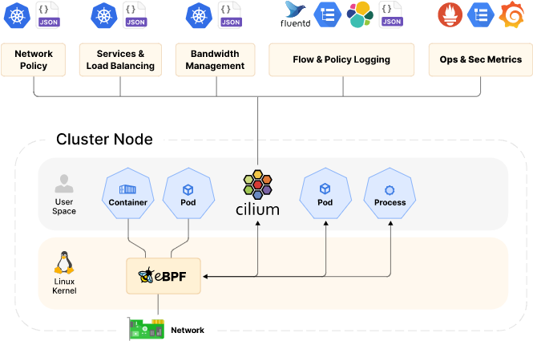

# 什么是Cilium

基于eBPF的网络插件，具有良好的可观测性和安全性。

Cilium是基于eBPF的新内核技术，能够在Linux中动态插入指令，从而可以达到安全，数据跟踪，数据控制等业务。因为eBPF运行在内核，因此可以在不修改业务代码情况下应用和跟新安全策略。

特点：

- 网络

  - 原生支持服务负载均衡和出口管理
  - 可扩展的Kubernetes CNI，对数据量和时延性能大大增强
  - 支持多集群的链接

- 可观察性

  - 身份感知
  - 高级自助服务观察
  - 网络指标和策略故障排查

- 安全性

  - 透明加密
  - 取证和审计
  - 高级网络策略

## 架构概览

Cilium包含一个在所有节点运行的代理. 他为在节点上运行的负载(例如:Pod, Service)提供网络, 安全性和可观察性. 工作负载可以被容器化或者本地化运行都可. 

# 什么是Hubble

Hubble 是一个完全分布式的网络和安全可观察性平台。它建立在 Cilium 和 eBPF 之上，能够以完全透明的方式深入了解服务的通信和行为以及网络基础设施。

通过在 Cilium 之上构建，Hubble 可以利用 eBPF 来实现可见性。通过依赖 eBPF，所有可见性都是可编程的，并允许采用动态方法，最大限度地减少开销，同时提供用户所需的深入和详细的可见性。Hubble 的创建和专门设计旨在充分利用这些新的 eBPF 功能。

Hubble可以完成以下事务:

## 服务依赖和通信映射

- 哪些服务在相互通信？频率如何？服务依赖图是什么样的？
- 正在进行哪些 HTTP 调用？服务消费或生产哪些 Kafka 主题？

## 网络监控和警报

- 是否有任何网络通信失败？为什么通讯失败？是DNS吗？是应用程序问题还是网络问题？第 4 层 (TCP) 或第 7 层 (HTTP) 上的通信是否中断？
- 哪些服务在过去 5 分钟内遇到了 DNS 解析问题？哪些服务最近遇到了 TCP 连接中断或连接超时？未应答的 TCP SYN 请求的比率是多少？

## 应用监控

- 特定服务或所有集群的 5xx 或 4xx HTTP 响应代码的比率是多少？
- 我的集群中 HTTP 请求和响应之间的第 95 个和第 99 个百分位延迟是多少？哪些服务表现最差？两个服务之间的延迟是多少？

## 安全可观察性

-  由于网络策略，哪些服务的连接被阻止？从集群外部访问了哪些服务？哪些服务解析了特定的 DNS 名称？

# 优势

eBPF 以前所未有的粒度和效率实现对系统和应用程序的可见性和控制。它以完全透明的方式执行此操作，无需以任何方式更改应用程序。eBPF 同样能够很好地处理现代容器化工作负载以及更传统的工作负载，例如虚拟机和标准 Linux 进程。

现代数据中心应用程序的开发已转向面向服务的架构，通常称为*微服务*，其中一个大型应用程序被拆分为小型独立服务，这些服务使用轻量级协议（如 HTTP）通过 API 相互通信。微服务应用程序往往是高度动态的，随着应用程序向外/向内扩展以适应负载变化以及在作为持续交付的一部分部署的滚动更新期间，单个容器开始或销毁。

这种向高度动态微服务的转变在保护微服务之间的连接方面既是挑战也是机遇。传统的 Linux 网络安全方法（例如 iptables）过滤 IP 地址和 TCP/UDP 端口，但 IP 地址在动态微服务环境中经常变动。容器的高度不稳定的生命周期导致这些方法难以与应用程序并行扩展，因为负载平衡表和访问控制列表承载着数十万条规则，需要以不断增长的频率进行更新。出于安全目的，协议端口（例如，用于 HTTP 流量的 TCP 端口 80）不能再用于区分应用程序流量，因为该端口用于跨服务的各种消息。

通过利用 Linux eBPF，Cilium 保留了透明插入安全可见性 + 实施的能力，但这样做的方式是基于Service / pod / Container Identified（与传统系统中的 IP 地址识别相反）并且可以过滤应用程序-层（例如 HTTP）。因此，Cilium 不仅通过将安全性与寻址解耦使得在高度动态的环境中应用安全策略变得简单，而且除了提供传统的第 3 层和第 4 层分段之外，还可以通过在 HTTP 层运行来提供更强的安全隔离.

## 功能概述

### 透明的保护API

能够保护现代应用程序协议，例如 REST/HTTP、gRPC 和 Kafka。传统防火墙在第 3 层和第 4 层运行。在特定端口上运行的协议要么完全受信任，要么完全被阻止。Cilium 提供了过滤单个应用程序协议请求的能力，例如：

- 允许所有带有 method`GET`和 path 的HTTP 请求`/public/.*`。拒绝所有其他请求。
- 允许`service1`在 Kafka 主题上生产`topic1`并`service2`在`topic1`. 拒绝所有其他 Kafka 消息。
- 要求所有 REST 调用中都存在HTTP 标头。`X-Token: [0-9]+`

在扩展方式中, 理论上可以实现基于协议层的处理

### 基于身份的安全服务通信

现代分布式应用程序依赖于应用程序容器等技术来促进部署的敏捷性和按需扩展。这导致在短时间内启动大量应用程序容器。典型的容器防火墙通过过滤源 IP 地址和目标端口来保护工作负载。这个概念要求每当容器在集群中的任何地方启动时，所有服务器上的防火墙都被操纵。

为了避免这种限制规模的情况，Cilium 为共享相同安全策略的应用程序容器组分配一个安全身份。然后，身份与应用程序容器发出的所有网络数据包相关联，从而允许在接收节点验证身份。使用键值存储执行安全身份管理。

### 与外部服务的安全访问

基于标签的安全是集群内部访问控制的首选工具。为了保护访问外部服务和来自外部服务的访问，支持传统的基于 CIDR 的入口和出口安全策略。这允许将访问和来自应用程序容器的访问限制为特定的 IP 范围。

### 简单网络

一个能够跨越多个集群的简单扁平的第 3 层网络连接所有应用程序容器。IP分配通过使用主机范围分配器保持简单。这意味着每个主机都可以分配 IP，而无需主机之间的任何协调。

当前支持一下网络模型:

- **Overlay:** 跨越所有主机的基于封装的虚拟网络。目前 VXLAN 和 Geneve 已被加入，但可以启用 Linux 支持的所有封装格式。

  何时使用此模式：此模式的基础架构和集成要求最低。它适用于几乎所有网络基础设施，因为唯一的要求是通常已经给定的主机之间的 IP 连接。

- **Native Routing:**使用 Linux 主机的常规路由表。网络需要能够路由应用程序容器的 IP 地址。

  何时使用此模式：此模式适用于高级用户，需要对底层网络基础架构有一定的了解。此模式适用于：

  - 本地 IPv6 网络
  - 配合云网路由器
  - 如果您已经在运行路由守护进程

### 负载均衡

Cilium 为应用容器和外部服务之间的流量实现分布式负载平衡，并能够完全替换kube-proxy等组件。负载平衡是在 eBPF 中使用高效的哈希表实现的，允许几乎无限的规模。

对于南北型负载均衡，Cilium的eBPF实现针对最大性能进行了优化，可以附加到XDPeXpress Data Path），并且在不执行负载均衡操作的情况下支持直接服务器返回（DSR）以及 Maglev 一致性哈希在源主机上。

对于东西类型的负载平衡，Cilium在Linux内核的套接字层（例如在 TCP 连接时）执行高效的服务到后端转换，这样可以在较低层避免每个数据包的 NAT 操作开销。

### 带宽管理

Cilium 通过基于 EDT（最早出发时间）的高效速率限制和 eBPF 来实现带宽管理，用于出口节点的容器流量。

### 监控和故障排除

额外提供的工具包括:

- 使用元数据进行事件监控：当数据包被丢弃时，该工具不仅会报告数据包的源 IP 和目标 IP，还提供发送方和接收方的完整标签信息以及许多其他信息。
- 通过 Prometheus 导出指标：关键指标通过 Prometheus 导出，以便与您现有的仪表板集成。
- Hubble：专为 Cilium 编写的可观察性平台。它基于流日志提供服务依赖关系图、操作监控和警报以及应用程序和安全可见性。
