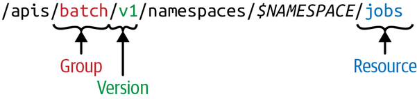
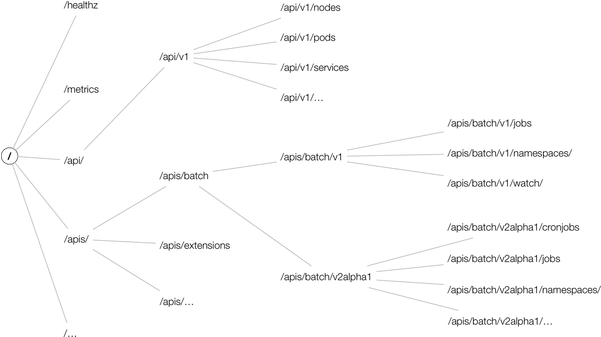
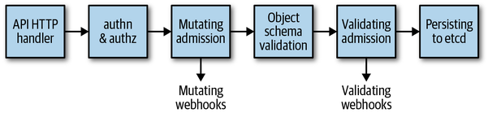

> 在本章将介绍K8S API的基础知识，包括深入了解API Server的内部工作原理、API本身如何以命令交互。还将介绍K8S API基本概念，例如资源种类、组、以及版本控制。

## API Server

K8S是由一堆不同角色的节点组成，如下图。主节点上的控制平面由API服务器、控制管理器和调度器组成。API服务器是由中央管理实体，也是唯一与分布式存储组件直接对话的组件-ETCD。

API Server的职责包括：

- 服务于K8S API。API在集群内部由组件、工作程序节点和K8S应用构成，以及适配各种外部访问方式的终端构成。

- 代理集群组件。例如仪表盘，日志，端口服务或者kubectl exec会话等。

提供API意味着需要提供：

- 读取状态：获取单个对象，整合对象，流式变更等
- 操作状态：创建，更新和删除对象。

状态是持久化的，例如由ETCD提供的持久化服务。

K8S的核心是API Server，但是API Server又是如何工作的呢？我们先将API Server当做是黑盒，先研究其提供的接口功能，再讨论其内部原理。

## HTTP接口

从客户端的角度看，API Server提供一个使用JSON或者protobuf的RESTful HTTP API，出于性能原因，该API主要用于集群内部通信。

遵照HTTP的通用接口规范，使用HTTP动词来表述资源的变更方式。例如：DELETE, POST, GET等

查看官网的[API](https://kubernetes.io/docs/reference/)接口文旦。

### API术语

- Kind

  实体资源的类型。K8S资源中，每个对象都有一个类型，类型有三种：

  - 单个持久实体： 例如Pod，EndPoint等。部分实体时需要区分命名空间的
  - 列表：实体的集合，例如PodLists，NodeLists等。
  - 用于特定对象的特定操作或者非持久实体：例如/binding, /scale以及Kubernetes使用的APIGroup，APIResource等。

K8S程序中，每一种都对应一种Golang的对象，因此作为Golang类型，种类是以单数并且是以大驼峰格式。

- API组

  表示一个逻辑的Kind的集合，添加s后缀。例如，Job的组信息为Jobs

- 版本

  每个API组可以存在多个版本，并且大多数都存在版本。并且版本应该是定义成演进式的，例如开始是v1alpha1然后最后毕业了，版本更新为v1。

- 资源

  通常标识为小写的单词复数，例如pods，标识一组HTTP路径，暴露系统中某个对象类型的CRUD操作，常见的路径有：

  - 根目录， 例如/pods，表示查看所有的pods
  - 单个资源路径，例如/pods/nginx，表示查看名称为nginx的资源

> 资源是对应的HTTP路径，而种类是这些资源的对象

资源始终是API组和版本的一部分，统称为GroupVersionResource（GVR），GVR唯一的定义了一条HTTP路径。例如：default空间的具体路径为：*/apis/batch/v1/namespaces/default/jobs*。 下图展示了一个Job的命名示例：

与GVR示例相比，集群范围资源在路径中不含$NAMESPACE信息，比如Node资源路径为/apis/v1/nodes。

因此每种资源都存在于一个API组中间，都包含版本控制，并且通过GroupVersionKind（GVK）进行标识。

> 共生 -- 同时存在于多个API 组
>
> 同一个Kind可能存在于多个版本，并且同一个Kind还可能存在于多个API组中包括：
>
> - `Ingress`, `NetworkPolicy` in `extensions` and `networking.k8s.io`
> - `Deployment`, `DaemonSet`, `ReplicaSet` in `extensions` and `apps`
> - `Event` in the core group and `events.k8s.io`

GVK和GVR是相关联的。GVK在GVR标识的HTTPS路径下提供服务。将GVK映射到GVR的过程称之为REST映射。

从全局角度看，API资源空间在逻辑上形成一棵树，包含顶级节点，分层节点，以及一些非分层的例如： /health, /metrics等。

此图仅是部分总览，具体的需要根据当前使用的K8S版本。

### K8S API版本控制

K8S支持在不同的API路径上支持多个API版本，例如：/api/v1或者/apis/extensions/v1beta1。在默认中，不同的版本提供不同的功能和稳定性以及支持：

- Alpha级别，通常默认禁用；对某个功能支持可能随时会消失，并且不提供通知。
- Beta级别，默认启用的级别；通常表示经过了测试，但是对象的内容可能会在后续的版本中以不兼容的的方式发生变化
- Stable级别，或者GA级别，例如v1；表示将出现在许多后续发布的版本中

此外，API还支持watch，比如，在请求参数中添加`?watch=true`，并且将API服务器变更为watch模式。

### 声明式状态管理

许多的API对象的当前状态与期望状态规范是有所区别的。所谓的规范（spec）是指对所需状态的完整描述，通常持久化，例如：etcd。

规范和状态

规范是指期望的状态，可以通过命令行获取，状态描述了实际的资源状态，有控制平面管理。例如，在部署中，可能会指定始终需要运行10个实例。部署控制器是控制平面的一部分，它通过读取部署规范并创建一个副本集，然后管理副本；任何副本的变化都将通知控制管理器。 这个就是所谓的声明式状态管理。

### 请求处理流程

1. HTTP请求由注册在DefaultBuildHandlerChain()中过滤器链处理。该链在*k8s.io/apiserver/pkg/server/config.go*中定义。它对请求做一些列的过滤操作，并将相应的信息附加到上下文。准确的说：ctx.RequestInfo中的ctx就是GO中的上下文。如果没有通过过滤器，就会即时的返回响应代码以及返回内容。
2. 下一步，根据HTTP路径，*k8s.io/apiserver/pkg/server/handler.go*中的多路复用器将 HTTP 请求路由到相应的处理程序。
3. 每个API组都注册了一个处理程序，它接受HTTP请求以及上下文，并从ETCD中检索和传递对象，参阅：*k8s.io/apiserver/pkg/endpoints/groupversion.go*和*k8s.io/apiserver/pkg/endpoints/installer.go*。

列举一些config.go中设置的过滤器，以及每个过滤器在`DefaultBuildHandlerChain()`中做的事情：

- `WithPanicRecovery()`

  负责恢复和日志处理，在*server/filters/wrap.go*中定义。

- `WithRequestInfo()`

  在上下文中添加RequestInfo信息，在endpoints/filters/requestinfo.go中定义。

- `WithWaitGroup()`

  将所有非长时间运行的请求添加到等待组；用于正常终止。在server/filters/waitgroup.go中定义。

- `WithTimeoutForNonLongRunningRequests()`

  超时非长时间运行的请求，例如：GET，PUT等。与之对应的长时间请求包括：监视、代理等。在server/filters/timeout.go中定义。

- `WithCORS()`

  提供CROS实现，定义在server/filters/cors.go中。

- `WithAuthentication()`

  提供身份验证，并将用户信息存储在上下文中。验证成功以后，`Authorization`将从请求头中移除HTTP表头。如果失败，则返回401，endpoints/filters/authentication.go 中定义。

- `WithAudit()`

  通过审计日志，对所有的传入请求审计。审计日志包含源IP，操作用户，请求的命名空间等，在admission/audit.go 中定义。

- `WithImpersonation()`

  通过更改用户的请求来处理用户模拟，类似于sudo，在endpoints/filters/impersonation.go 中定义。

- `WithMaxInFlightLimit()`

  限制进行中的请求储量，在server/filters/maxinflight.go中定义。

- `WithAuthorization()`

  通过调用授权模块检查权限，并将所有授权请求传递给多路复用器，复用器请求分配改正确的处理程序。如果用户没有足够的权限，它会返回403状态码。K8S使用RBAC的方式进行管理，在endpoints/filters/authorization.go中定义。

在过滤链处理完了之后（图中第一个框），实际的请求处理开始执行：

- 直接处理/health等非层级请求

- RESTFul资源的请求进入请求队列，包括：

  - *admission*

    传入的对象通过一个准入链，链中大约有20中不同的admission插件，每个插件都是变异阶段的一部分（第三个框），验证阶段的一部分（第四个框），或者都包含。在变异阶段，可以更改传入的请求负载；如，Image策略的执行就取决于admission配置

  - `validation`

    根据对象验证传入的参数是否有效，例如：传入的IP是不是合法的

  - `CRUD逻辑`

    这里实现在持久层的数据处理，例如：将新的状态写入ETCD

还包含更多的资源例如：自定义资源，Golang的原生资源

变异插件列表包含（有顺序的，版本1.14）：

`AlwaysAdmit`, `NamespaceAutoProvision`, `NamespaceLifecycle`, `NamespaceExists`, `SecurityContextDeny`, `LimitPodHardAntiAffinityTopology`, `PodPreset`, `LimitRanger`, `ServiceAccount`, `NodeRestriction`, `TaintNodesByCondition`, `AlwaysPullImages`, `ImagePolicyWebhook`, `PodSecurityPolicy`, `PodNodeSelector`, `Priority`, `DefaultTolerationSeconds`, `PodTolerationRestriction`, `DenyEscalatingExec`, `DenyExecOnPrivileged`, `EventRateLimit`, `ExtendedResourceToleration`, `PersistentVolumeLabel`, `DefaultStorageClass`, `StorageObjectInUseProtection`, `OwnerReferencesPermissionEnforcement`, `PersistentVolumeClaimResize`, `MutatingAdmissionWebhook`, `ValidatingAdmissionWebhook`, `ResourceQuota`, and `AlwaysDeny`.