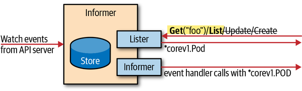
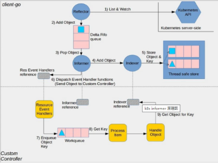
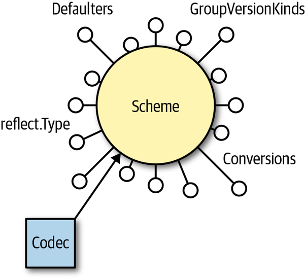
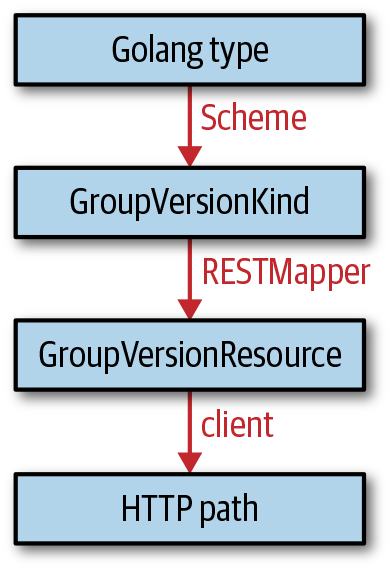

> 本章我们关注Go语言中的K8S编程接口。将学习如何通过K8S API访问原生类型。

## 客户端库

Go 中的 Kubernetes 编程接口主要由*k8s.io/client-go*库组成（为简洁起见，我们将其称为`client-go`）。*client-go*是一个典型的 Web 服务客户端库，它支持所有正式属于 Kubernetes 的 API 类型。它可以用来执行的操作包含：

- *Create*
- *Get*
- *List*
- *Update*
- *Delete*
- *Patch*

这个REST动词都是由API服务器的HTTP接口实现的，此外，还支持动词Watch，这是K8S所特有的。在K8S库中，每一个K8S版本都有与之对应的client-go版本。

API类型Pod是遗留的API组v1（核心组）的一部分，因此Pod的Go类型在k8s.io/api/core/v1*中，其他类型也是分布在对应的API组中。

实际的Go类型定义在*k8s.io/api/core/v1/types.go*中，其中部分是有代码生成器生成的。

## API Machinery

最重要的，，有个API Machinery的三方库，在`k8s.io/apimachinery`Go 中，它包括所有的API实现。API Machinery不仅管理容器，还可以用于构建用于特定领域的API。

API Machinery中会有许多包，重要的是*k8s.io/apimachinery/pkg/apis/meta/v1*包中，它包含许多通用的API，例如：ObjectMeta`，`TypeMeta`，`GetOptions`，和`ListOptions。

## 版本控制和兼容性

客户端的版本需要与服务端的版本匹配，客户端同时包含了实现的不不同的API版本。客户端被硬编码成不同的版本。

API Server的元API特性都包含与HTTP动词对应的API，例如CreateOptions，GetOptions等。它是每个Kind的一部分。称之为API机械特性。

关于API组的版本需要注意两点：

- API组版本适用于整个组内资源，API版本可能存在某些正交版本，例如，在不同的组，会有不同的质量版本。因此，对于此类API通常有部分开关控制是否启用。
- 组版本仅在访问时才发生作用

## Go中的K8S对象

K8S资源既对象，是有API Server提供的，它们表示为结构。不同类型的领域，会有不同的结构，但有一部分是公共的。K8S对象实现了一个来自*k8s.io/apimachinery/pkg/runtime*的Object的接口，以及来自*k8s.io/apimachinery/pkg/runtime/schema*的ObjectKind接口。

```go
// Object interface must be supported by all API types registered with Scheme.
// Since objects in a scheme are expected to be serialized to the wire, the
// interface an Object must provide to the Scheme allows serializers to set
// the kind, version, and group the object is represented as. An Object may
// choose to return a no-op ObjectKindAccessor in cases where it is not
// expected to be serialized.
type Object interface {
    GetObjectKind() schema.ObjectKind
    DeepCopyObject() Object
}
```

Go中的K8S对象是一种数据额接口，它可以：

- 放回并设置GVK
- 被深拷贝

深拷贝是数据结构的克隆，它不与原来的对象共享内存。它作用于代码必须在不修改原始对象的情况下改变对象的地方。简而言之，对象存储允许克隆。

## TypeMeta

虽然`runtime.Object`是只是一个接口，我们想知道它是如何实现的。*来自k8s.io/api*的Kubernetes 对象`schema.ObjectKind`通过嵌入*k8s.io/apimachinery/meta/v1.TypeMeta*中的结构来实现类型 getter 和 setter。

例如，Pod的声明如下：

```go
// Pod is a collection of containers that can run on a host. This resource is
// created by clients and scheduled onto hosts.
type Pod struct {
    metav1.TypeMeta `json:",inline"`
    // Standard object's metadata.
    // +optional
    metav1.ObjectMeta `json:"metadata,omitempty"`

    // Specification of the desired behavior of the pod.
    // +optional
    Spec PodSpec `json:"spec,omitempty"`

    // Most recently observed status of the pod.
    // This data may not be up to date.
    // Populated by the system.
    // Read-only.
    // +optional
    Status PodStatus `json:"status,omitempty"`
}
```

其中，TypeMeta和ObjectMeta都是嵌入式的，都是根据外部的定义直接解析，并嵌入的。

那么，客户端如何填写对象元呢？

- Kind只是Go的类型名称，它可以通过反射从对象派生。
- 该组只是Go包名称，在*k8s.io/api/apps*中声明。 但是并非所有情况下都匹配；核心组可能是空组名，例如：`rbac.authorization.k8s.io`

## ObjectMeta

在类型元之外，大多数顶级对象都有一个metav1.ObjectMeta，与TypeMeta来自相同的包。

例如定义的数据：

```go
type ObjectMeta struct {
    Name string `json:"name,omitempty"`
    Namespace string `json:"namespace,omitempty"`
    UID types.UID `json:"uid,omitempty"`
    ResourceVersion string `json:"resourceVersion,omitempty"`
    CreationTimestamp Time `json:"creationTimestamp,omitempty"`
    DeletionTimestamp *Time `json:"deletionTimestamp,omitempty"`
    Labels map[string]string `json:"labels,omitempty"`
    Annotations map[string]string `json:"annotations,omitempty"`
    ...
}
```

通常，它包含所有的元级别信息，如：名称、命名空间、资源版本等。

资源版本在乐观并发中几乎不会从client-go代码中读取或者写入。但是它是K8S系统中的工作领域之一。resourceVersion是ObjectMeta中的一部分。

## spec and status

最后，几乎每个顶级对象都有一个spec和stauts部分。这个约定来自于K8S API的生命性质：spec是用户的期望，status是这种期望的结果，通常由系统中的控制单元填充。

但是包含一部分例外，例如核心组中的EndPoint，或者RBAC对象

## Client Sets

`kubernetes.NewForConfig(config)`为我们提供了一个*客户端集*。客户端集允许访问多个 API 组和资源的客户端。

在*k8s.io/client-go/kubernetes*中，通过kubernetes.NewForConfig(config)提供API, 允许访问*k8s.io/api*中定义的所有 API 组和资源。也有部分例外如：APIService和CustomResourceDefinition。

不仅仅访问K8S资源使用K8S的Client set，访问自定义资源也是使用Client Sets。

*k8s.io/client-go/kubernetes/typed*中用于K8S原生资源的客户端设置主界面如下：

```go
type Interface interface {
    Discovery() discovery.DiscoveryInterface
    AppsV1() appsv1.AppsV1Interface
    AppsV1beta1() appsv1beta1.AppsV1beta1Interface
    AppsV1beta2() appsv1beta2.AppsV1beta2Interface
    AuthenticationV1() authenticationv1.AuthenticationV1Interface
    AuthenticationV1beta1() authenticationv1beta1.AuthenticationV1beta1Interface
    AuthorizationV1() authorizationv1.AuthorizationV1Interface
    AuthorizationV1beta1() authorizationv1beta1.AuthorizationV1beta1Interface

    ...
}
```

客户端集还提供外部client的访问方式，例如：RESTMapper转换命令行为Rest请求来访问数据。

在GroupVersion中，提供API组的访问接口：

```go
type AppsV1beta1Interface interface {
    RESTClient() rest.Interface
    ControllerRevisionsGetter
    DeploymentsGetter
    StatefulSetsGetter
}
```

根据资源的范围，Namespace的或者Cluster的，会提供带命名空间或不带命名空间参数的请求。

RESTClient作为通用REST客户端提供的接口如下，每个资源都是一个接口：

```go
// DeploymentsGetter has a method to return a DeploymentInterface.
// A group's client should implement this interface.
type DeploymentsGetter interface {
    Deployments(namespace string) DeploymentInterface
}

// DeploymentInterface has methods to work with Deployment resources.
type DeploymentInterface interface {
    Create(*v1beta1.Deployment) (*v1beta1.Deployment, error)
    Update(*v1beta1.Deployment) (*v1beta1.Deployment, error)
    UpdateStatus(*v1beta1.Deployment) (*v1beta1.Deployment, error)
    Delete(name string, options *v1.DeleteOptions) error
    DeleteCollection(options *v1.DeleteOptions, listOptions v1.ListOptions) error
    Get(name string, options v1.GetOptions) (*v1beta1.Deployment, error)
    List(opts v1.ListOptions) (*v1beta1.DeploymentList, error)
    Watch(opts v1.ListOptions) (watch.Interface, error)
    Patch(name string, pt types.PatchType, data []byte, subresources ...string)
        (result *v1beta1.Deployment, err error)
    DeploymentExpansion
}
```

## 状态子资源：UpdateStauts

Deployments包含一个status subresource，表示使用附加的http端点，以/status结尾。

例如在/apis/apps/v1beta1/namespaces/`ns`/deployments/`name`上更改作用于指定的Deployment，在加上/status后缀以后，可以变更对象的状态。这个在spec更新和status更新需要分开设置权限时特别有用。

默认的client-gen生成的UpdateStatus()方法，默认情况下并不能保证资源支持子资源。

## Listings and Deletions

`DeleteCollection` 允许我们一次删除一个命名空间的多个对象。该`ListOptions`参数允许我们定义应该删除哪些对象使用*字段*或*标签选择器*：

```go
type ListOptions struct {
    ...

    // A selector to restrict the list of returned objects by their labels.
    // Defaults to everything.
    // +optional
    LabelSelector string `json:"labelSelector,omitempty"`
    // A selector to restrict the list of returned objects by their fields.
    // Defaults to everything.
    // +optional
    FieldSelector string `json:"fieldSelector,omitempty"`

    ...
}
```

## Watches

`Watch`给对象的所有变更的事件接口。定义在*k8s.io/apimachinery/pkg/watch*中，返回的内容如下

```go
// Interface can be implemented by anything that knows how to watch and
// report changes.
type Interface interface {
    // Stops watching. Will close the channel returned by ResultChan(). Releases
    // any resources used by the watch.
    Stop()

    // Returns a chan which will receive all the events. If an error occurs
    // or Stop() is called, this channel will be closed, in which case the
    // watch should be completely cleaned up.
    ResultChan() <-chan Event
}
```

通道中返回三种事件：

```go
// EventType defines the possible types of events.
type EventType string

const (
    Added    EventType = "ADDED"
    Modified EventType = "MODIFIED"
    Deleted  EventType = "DELETED"
    Error    EventType = "ERROR"
)

// Event represents a single event to a watched resource.
// +k8s:deepcopy-gen=true
type Event struct {
    Type EventType

    // Object is:
    //  * If Type is Added or Modified: the new state of the object.
    //  * If Type is Deleted: the state of the object immediately before
    //    deletion.
    //  * If Type is Error: *api.Status is recommended; other types may
    //    make sense depending on context.
    Object runtime.Object
}
```

虽然直接使用此接口很诱人，但实际上不鼓励使用 Informers。Informer 是此事件接口和具有索引查找的内存缓存的组合。这是迄今为止最常见的手表用例。在幕后，Informers首先调用`List`客户端以获取所有对象的集合（作为缓存的基线），然后`Watch`更新缓存。它们正确处理错误情况——即从网络问题或其他集群问题中恢复。

## Client Expansion

`DeploymentExpansion` 是实际上是一个空接口。它用于添加自定义客户端行为，但现在在 Kubernetes 中几乎不使用它。相反，客户端生成器允许我们以声明方式添加自定义方法。

再次注意，所有这些方法`DeploymentInterface`都不期望`TypeMeta`字段`Kind`和中的有效信息`APIVersion`，也不将这些字段设置为`Get()`和`List()`。这些字段仅在线路上填充实际值。

## Client Options

在客户端中，可以设置使用原生的类型或者protobuf格式。

？？

优雅关机和对连接错误的恢复能力

要求分为长期运行和非长期运行。手表是长期运行的，而`GET`、`LIST`、`UPDATE`等是非长期运行的。许多子资源（例如，用于日志流、exec、端口转发）也是长期运行的。

当 Kubernetes API 服务器重新启动时（例如，在更新期间），它会等待长达 60 秒以正常关闭。在此期间，它会完成非长时间运行的请求，然后终止。当它终止时，诸如正在进行的监视连接之类的长时间运行的请求将被切断。

无论如何，非长时间运行的请求都以 60 秒为界（然后它们超时）。因此，从客户端的角度来看，关闭是优雅的。

通常，应用程序代码应始终为不成功的请求做好准备，并且应以对应用程序不致命的方式进行响应。在分布式系统的世界里，那些连接错误是正常的，无需担心。但是需要特别注意小心处理错误情况并从中恢复。

错误处理对于手表。手表是长期运行的，但它们随时可能出现故障。下一节中描述的告密者提供了一个围绕监视的弹性实现并优雅地处理错误——也就是说，它们通过新连接从断开连接中恢复。应用程序代码通常不会注意到。

## Informers and Caching

客户端接口包括`Watch`动词，它提供了一个事件接口，对对象的更改（添加、删除、更新）做出反应。Informers 为最常见的 watch 用例提供了更高级别的编程接口：内存缓存和快速、按名称或内存中其他属性的对象索引查找。

每次需要对象时访问 API 服务器的控制器会在系统上产生高负载。使用通知者的内存缓存是解决此问题的方法。此外，informers 可以几乎实时地对对象的变化做出反应，而不需要轮询请求。

下图显示了告密者的概念模式；具体来说：

- 从 API 服务器获取输入作为事件。
- 提供一个类似客户端的接口`Lister`，用于从内存缓存中获取和列出对象。
- 为添加、删除和更新注册事件处理程序。
- 使用*存储*实现内存缓存。



告密者还具有高级错误行为：当长时间运行的监视连接中断时，它们会通过尝试另一个监视请求来从中恢复，在不丢失任何事件的情况下拾取事件流。如果中断时间很长，并且 API 服务器丢失事件，因为`etcd`在新的监视请求成功之前从其数据库中清除了事件，通知者将 重新列出所有对象。

在*relists 旁边*，有一个用于内存缓存和业务逻辑之间协调的可配置重新*同步周期*：每次经过此周期时，将为所有对象调用已注册的事件处理程序。常用值以分钟为单位（例如，10 或 30 分钟）。

`Watch()`所有这些先进且经过实战验证的错误行为是使用通知者而不是直接使用客户端方法推出自定义逻辑的一个很好的理由。Informer 在 Kubernetes 本身中无处不在，是 Kubernetes API 设计中的主要架构概念之一。

虽然通知者比轮询更受欢迎，但它们会在 API 服务器上产生负载。每个 GroupVersionResource 一个二进制文件应该只实例化一个通知者。到使informer的共享变得容易，我们可以使用*shared informer factory*来实例化一个informer 。

共享的informer 工厂允许informer 在应用程序中共享相同的资源。换句话说，不同的控制循环可以在后台使用相同的监视连接到 API 服务器。

informer工作框架如下：



## 深入了解 API Machinery 

API Machinery是K8S类型的系统基础知识，在API Machinery不存在Type类型，使用的是Kinds类型

### Kinds

API Machinery库中的一个核心是GroupVersionKind，简称GVK。在Go中，每个GVK对应一种Go类型，一个Go类型可以属于多个GVK。

Kind没有在HTTP路径做一对一的映射，许多的Kind都提供对象的HTTP访问方法，但是也有一部分没有提供，例如：admission.k8s.io/v1beta1.AdmissionReview，此Kind用于调用webhook。同时，也有从许多端点返回的Kind，例如：Status。

按照惯例，Kind使用大驼峰命名，单数。对于CRD，必须使用DNS路径规范的标签。

### Resources

与Kind平行的一种概念。也再次被分组和版本话，使用属于GroupVersionResource，简称GRV。

每个GVR对应一个HTTP路径。GVR用于识别K8S API的Rest 端点。例如：GVR *apps/v1.deployments*映射到*/apis/apps/v1/namespaces/ `namespace`/deployments*。

客户端使用此映射来构建访问GVR的HTTP路径。

通常资源使用小写，复数方式，也必须符合DNS命名规范。

### REST Mapping

GVK到GVR的映射，称之为REST Mapping。一个REST Mapping是一个Golang接口，可以通过接口想GVR请求GVK，例如：

```go
RESTMapping(gk schema.GroupKind, versions ...string) (*RESTMapping, error)
```

### Scheme

在*k8s.io/apimachinery/pkg/runtime*中，scheme用于将Golong与GVK连接起来。将Golong类型映射到可能的GVK。

```go
func (s *Scheme) ObjectKinds(obj Object) ([]schema.GroupVersionKind, bool, error)
```

一个对象可以通过该`GetObjectKind() schema.ObjectKind`方法返回其组和种类。但是，这些值大部分时间都是空的。

scheme通过给定对象的Golong类型反射，并将映射到该Golong类型的已经注册的GVK。前提需要将Golong类型必须注册到方案中。

```go
scheme.AddKnownTypes(schema.GroupVersionKind{"", "v1", "Pod"}, &Pod{})
```

Scheme不仅用于注册Golang和GVK，还用于存储转换函数和默认值列表，也是实现编码器的解码器的数据源。



对于K8S的核心类型，在k8s.io/client-go/kubernetes/scheme包中的客户端集中有一个预定义的方案client-go，所有的type都预先注册。默认，有client-gen生成的代码，包含scheme客户端，所有组合版本。



