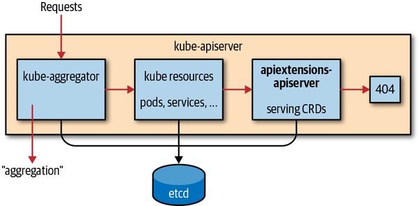
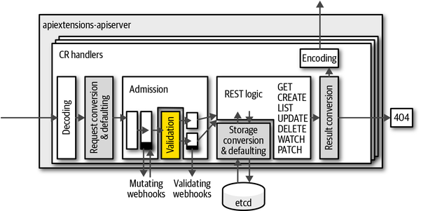

自定义资源是整个K8S生态中使用的核心扩展机制之一。

自定义资源用于小型的内部配置对象，没有任何相应的控制器逻辑——纯粹以声明方式定义。但是，自定义资源对于许多在 Kubernetes 之上想要提供 Kubernetes 原生 API 体验的严肃开发项目也起着核心作用。例如 Istio、Linkerd 2.0 和 AWS App Mesh 等服务网格，它们都以自定义资源为核心。

### 发现过程

CR存储在同一个ETCD实例中，如果资源不是以下类型，则退回到apiextensions-apiserver处理：

- 由聚合的 API 服务器处理。
- 原生 Kubernetes 资源。



CustomResourceDefinition (CRD) 是 Kubernetes 资源本身。它描述了集群中可用的 CR。

CRD中定义了资源的信息，包括：单数名称，复数名称，简称等等。kubectl get **，中的就是资源的名称。

> kubectl 命令添加  -v=7可以查看过程信息。

例如要查看一个ats的资源，具体查看步骤是：

1. 最开始kubectl不知道ats
2. 因此，kubectl通过/apis/访问API Groups，获取所有存在的API组
3. kubectl通过/apis/groupversion访问API groups，获取所有的API Group资源
4. kubectl将给定类型转换为三元组信息：
   1. Group (cnat.programming-kubernetes.info`)
   2. Version (v1alpha1`)
   3. Resource (ats).

### 类型定义

CRD 是Kubernetes API 服务器进程内部`apiextensions.k8s.io/v1beta1`提供的API 组中的 Kubernetes 资源`apiextensions-apiserver`。

类型定义的资源的三元信息，自定义的属性，等等，并给属性允许或者设置的默认值。

### CR验证

CR在创建和更新的过程中，根据CRD规范中定义的字段，通过OpenAPI v3进行验证。

可以在验证准入 webhook 中实现更复杂的验证，即使用图灵完备的编程语言。图中显示这些 webhook 是在本节中描述的基于 OpenAPI 的验证之后直接调用的。在“Admission Webhooks”中，我们将看到 admission webhooks 是如何实现和部署的。在那里，我们将研究考虑其他资源的验证，因此远远超出 OpenAPI v3 验证。幸运的是，对于许多用例，OpenAPI v3 模式就足够了。



在实际操作中，多数项目提供了部分的代码生成，例如KubeBuilder，Operator SDK。

### 子资源

子资源是特殊的 HTTP 端点，使用附加到普通资源的 HTTP 路径的后缀。例如Pod的status，exec，logs等等。自定义资源目前是支持两个，/scale和/status。 通过在CRD中的显示是否启用。

### 开发人员如何使用CRD

自定义资源允许多个客户端通过Golong访问，包括：

- 使用client-go动态客户端
- 使用类型化客户端
  - 由kubernetes-sigs/controller-runtime 提供，供 Operator SDK 和 Kubebuilder 使用。
  - 有client-gen生成

#### 动态客户端

k8s.io/client-go/dynamic中的动态客户端与已知的 GVK 完全无关。它甚至不使用除unstructured.Unstructured之外的任何 Go 类型，它只包装了json.Unmarshal。既语言使用原生的Golong对象进行处理。

动态客户端标识既不使用RESTMapper，意味着开发人员必须通过GVR的形式提供资源，自己定义对象。

#### 类型化客户端

与动态化对应的，Golong不直接使用原始的对象，而是使用realGolong对象，每个对象对应了实际的GVK对象。相当于在动态客户端的基础上进行了封装，带来的好处就是使用更方便便捷，同样，也降低了灵活性。


Kinds表示为Golong结构，被命名为Kind，并且放置在与GVK的组和版本对应的保重，一般约定是放置在*`group`*/*`version`*.*`Kind`*中。

```go
pkg/apis/group/version
```

Kind在文件types.go中定义了一个Golong结构。每个与GVK对应的Golong类型都嵌入k8s.io/apimachinery/pkg/apis/meta/v1/TypeMeta的结构中。TypeMeta仅有Kind和ApiVersion组成。

另外，每个顶级类型都有自己的Endpoint，因此有与GVR对应的存储名称，资源命名空间的元数据，元数据存储在k8s.io/apimachinery/pkg/apis/meta/v1/ObjectMeta中，如下：

```go
type ObjectMeta struct {
    Name string `json:"name,omitempty"`
    Namespace string `json:"namespace,omitempty"`
    UID types.UID `json:"uid,omitempty"`
    ResourceVersion string `json:"resourceVersion,omitempty"`
    CreationTimestamp Time `json:"creationTimestamp,omitempty"`
    DeletionTimestamp *Time `json:"deletionTimestamp,omitempty"`
    Labels map[string]string `json:"labels,omitempty"`
    Annotations map[string]string `json:"annotations,omitempty"`
    ...
}
```

此外还有许多附加字段，具体内容参考：[内联文档](https://github.com/kubernetes/apimachinery/blob/0aa9751e8aaff1b6afa1ca5270d8e280878797e4/pkg/apis/meta/v1/types.go#L94)。

K8S的顶级类型会被持久化到ETCD中，通常都具有spec和status。

```go
type Deployment struct {
    metav1.TypeMeta `json:",inline"`
    metav1.ObjectMeta `json:"metadata,omitempty"`

    Spec DeploymentSpec `json:"spec,omitempty"`
    Status DeploymentStatus `json:"status,omitempty"`
}
```

#### Golong包结构

作为我们已经看到，Golang 类型传统上放置在包*pkg/apis/* */中名为**types.go*的文件中。除了该文件之外，我们现在还想查看更多文件。其中一些是由开发人员手动编写的，而另一些是使用代码生成器生成的。

doc.go文件描述了 API 的用途，并包含许多包全局代码生成标签：

```go
// Package v1alpha1 contains the cnat v1alpha1 API group
//
// +k8s:deepcopy-gen=package
// +groupName=cnat.programming-kubernetes.info
package v1alpha1
```

接下来，*register.go*包含帮助器将自定义资源 Golang 类型注册到方案中：