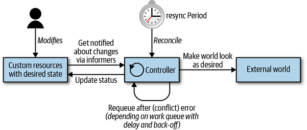
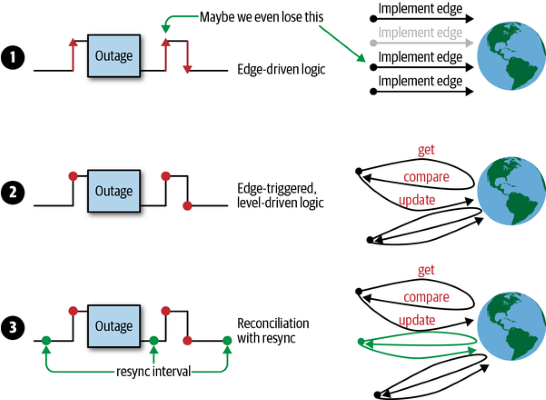
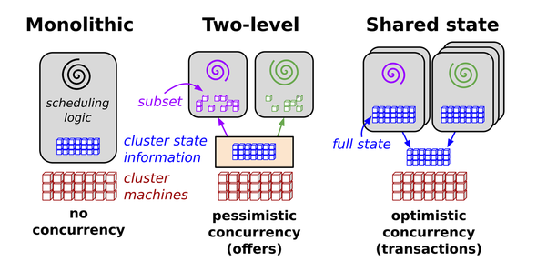
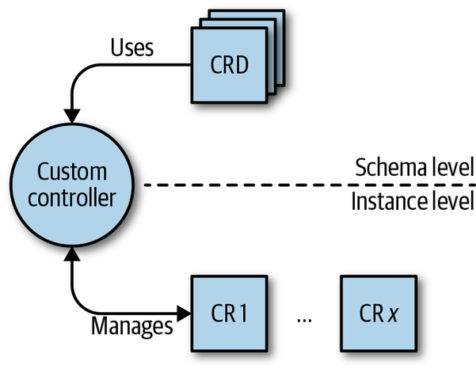

## 为什么需要Kubernetes编程

​		Kubernetes提供了通用一些应用场景，可以对比Java语言一样。例如：Pod映射成为Class，Pod的初始化映射成为类的初始化等等。因此，对于不同的应用场景，会不要不同的对Kubernetes资源的不同组合，不同处理方式。 可编程意味着可以更灵活，更贴合业务，更易于处理。

​		在此之前，需要具备的能力包括：Go语言，Kubernetes基础支持。虽然有多种选择方式对Kubernetes进行编程处理，例如Shell，Python等等。现在大于70%的云原生组件使用Go语言开发，因此我们首先将重点放在使用Go语言进行 编写，也让我们具备阅读开源组件的能力。

​		Kubernetes编程是指开发一个Kubernetes原生应用程序或者Kubernetes资源，通过与API Server交互达到我们预期的目的。K8S控制着应用程序的生命周期--查找节点以运行、拉取镜像、启动容器、执行健康检查、挂载卷等等——仅此而已。找到要运行的节点、拉取镜像、启动容器、执行健康检查、挂载卷等等——就是这样。 使用API获得的编程，具有很好的可移植性，提供干净，声明式的机制。

## Webhook模式

WebHook 是一种 HTTP 回调：某些条件下触发的 HTTP POST 请求；通过 HTTP POST 发送的简单事件通知。一个基于 web 应用实现的 WebHook 会在特定事件发生时把消息发送给特定的 URL。

具体来说，当在判断用户权限时，`Webhook` 模式会使 Kubernetes 查询外部的 REST 服务。

Kubernetes提供了多种Webhook用在特定的时候触发特定的动作例如：MutatingAdmissionWebhook,ValidatingAdmissionWebhook

## 例子

我们需要系统在一个指定的时间内打印一段指定的字符，在2022年10月1日0零0分0秒，打印“Hello China”。部署文件如下：

```yaml
apiVersion: cnat.programming-kubernetes.info/v1alpha1
kind: At
metadata:
  name: cnrex
spec:
  schedule: "2022-10-01T00:00:00Z"
  containers:
  - name: shell
    image: centos:7
    command:
    - "bin/bash"
    - "-c"
    - echo "Hello China"
```

那么在后台涉及到的组件：

- 一个名为cnat.programming-kubernetes.info/cnrex 的自定义资源
- 在正确的时间执行命令的控制器

## 扩展模式

Kubernetes是一个功能强大且具有内在可扩展性的系统。通常，有多种方法可以自定义和/或扩展 Kubernetes：使用配置文件和标志用于控制平面组件（如`kubelet`Kubernetes API 服务器），以及通过许多定义的扩展点：

- 云提供商提供的云控制器等
- 用于网络、设备、存储、运行时等的kubelet插件
- 二进制kubelet插件
- API Server中的访问扩展，例如包含webhook的准入控制
- 自定义资源和自定义控制器
- 调度程序扩展，例如使用webhook来实现自己的调度策略
- 使用webhook进行身份验证

在本例中，我们关注自定义资源、控制器、webhook 和自定义 API 服务器

## Controller和Operator

*控制器*实现了一个控制循环，通过 API 服务器监视集群的共享状态并进行更改以尝试将当前状态移动到所需状态。

- Controller可以作用于部署或服务等核心资源，这些资源通常是控制平面中Kubernetes 控制器管理器的一部分，也可以监视和操作用户定义的自定义资源。
- Operator是对一些操作知识进行编码的控制器，例如应用程序生命周期管理，定义的自定义资源。

### The Control Loop

1. 阅读资源的状态，最好是事件驱动的。。
2. 更改集群或集群外部世界中对象的状态。例如，启动 pod、创建网络端点或查询云 API。
3. 通过 API 服务器在步骤 1 中更新资源的状态`etcd`。
4. 重复循环；返回步骤 1。

无论你的控制器多么复杂或简单，这三个步骤——读取资源状态˃改变世界˃更新资源状态——保持不变



从架构的角度，控制器使用以下数据结构：

Informers

​		Informers以可扩展和可持续的方式观察所需的资源状态。它们还实现了一种重新同步机制，该机制强制执行定期协调，并且通常用于确保集群状态和缓存在内存中的假定状态不会漂移（例如，由于错误或网络问题） ）。

Work queue

​		Work queue是一个组件，用来帮助处理状态变更的队列。Client-go可以通过workqueue包获取。

### Events

Kubernetes 控制平面大量使用事件和松散耦合组件的原则。其他分布式系统使用远程过程调用 (RPC) 来触发行为，但Kubernetes 没有。Kubernetes 控制器通过监视 API 服务器中 Kubernetes 对象的变化，如：添加、更新和删除。当此类事件发生时，控制器将执行其业务逻辑。

例如，在一个部署Pod过程中可能经过的过程：

1. 部署控制器（内部`kube-controller-manager`）通知（通过部署通知者）用户创建部署。它在其业务逻辑中创建了一个副本集。
2. 副本集控制器（再次在内部`kube-controller-manager`）通知（通过副本集通知器）新的副本集并随后运行其业务逻辑，从而创建一个 pod 对象。
3. 调度器（在二进制文件中）——它也是一个控制器——通过一个空字段`kube-scheduler`通知 pod（通过 pod informer） 。`spec.nodeName`它的业务逻辑将 pod 放入它的调度队列中。
4. 同时——另一个控制器——注意到新的`kubelet`pod（通过它的 pod 通知器）。但新 pod 的字段为空，因此与' 的节点名称`spec.nodeName`不匹配。`kubelet`它忽略 pod 并重新进入睡眠状态（直到下一个事件）。
5. `spec.nodeName`调度器将 pod 从工作队列中取出，并通过更新pod 中的字段并将其写入 API 服务器，将其调度到具有足够空闲资源的节点上。
6. 由于`kubelet`pod 更新事件，它再次唤醒。它再次将`spec.nodeName`与自己的节点名称进行比较。名称匹配，因此`kubelet`启动 pod 的容器，并通过将此信息写入 pod 状态报告回容器已启动，返回给 API 服务器。
7. 副本集控制器注意到更改的 pod 但无事可做。
8. 最终，pod 终止。会注意到这`kubelet`一点，从 API 服务器获取 pod 对象并在 pod 的状态中设置“终止”条件，并将其写回 API 服务器。
9. 副本集控制器注意到终止的 pod 并决定必须更换这个 pod。它会删除 API 服务器上终止的 pod 并创建一个新的。

上述事件通过API服务器发送到控制器内部的通知者--Watcher。事件对用户来说是不可见的，甚至对控制器可不可见，只有当对象状态发生变化时才可见。控制器可以对事件做出反应，例如日志输出。

>  watch事件和事件对象二者不是同一个内容
>
> - watch事件通过API服务器和控制器之间的HTTP连接发送事件给消费
> - 事件对象是一种类似于POD的资源，有一定的特殊性，仅仅能存活1小时，之后会从ETCD中移除。

### Trigger

更抽象的看如何在控制器中实现业务逻辑，以及为什么K8S选择通过事件驱动。

有两个原则来检测状态变化：

- 边缘驱动触发器

  在状态改变时触发，例如：从没有Pod到有Pod运行

- 等级驱动触发器

  定期的状态检查，例如：检测到Pod停止运行则触发

根据二者不同的效率问题，边缘K8S是基于边缘驱动的触发器。在控制平面中，当组件更改API服务器上面的对象时，都会导致一个事件（边缘），这些引起事件的组件被称为事件源。在控制器上下文中，通过通知者消费此种事件。

在分布式系统中，许多的参与者并行运行，事件产生的方式是异步的，随机的。如果有错误的控制器逻辑或者状态机甚至是外部服务故障，很有可能引起事件丢失。因此需要考虑如何处理可能发生的错误。

下面是几个策略：

1. 仅仅边缘驱动的情况，可能会丢失某个状态更改。
2. 仅仅等级驱动触发时，处理事件是总会是最新的状态。
3. 二者结合，事件驱动并且定时同步



## 更改集群&外部资源

在变更阶段，控制器改变它管理的对象的状态，例如，控制管理器ReplicaSet中的控制器正在监督Pod。每个事件上，控制器观察其Pod的期望状态和实际状态是否一致。

先看看RS（ReplicaSet）控制器，RS控制器用于部署，最基本的功能是：维护用户定义的POD数量和实际的POD数量相同。

另一方面，控制器除了更改集群本身（Kubernetes资源）以外，还可以更改外部的资源，例如：云服务存储等。这使得控制器非常灵活和强大，提供了跨平台和环境使用资源的一种方式。

## 乐观并发

控制器在根据规范更新集群对象或外部资源后将结果写入资源状态。在分布式系统中，可能包含多个控制器并发写入一个资源状态的情况。由于写入冲突，有可能造成写入失败。




*解决方案是一种围绕共享状态构建的新并行调度器架构，使用无锁乐观并发控制，以实现实现可扩展性和性能可扩展性。这种架构正在谷歌的下一代集群管理系统 Omega 中使用。*

更改对象时在Meta信心中总会包含一个版本信息resourceVersion，更改的对象总会指定版本信息，当其他资源修改了资源后，版本信息发生变化，因此再次的修改将会失败。

控制器的操作策略是不断的重试，在分布式场景，错误总是会发生的，并且期待优雅的对待他们。

## Operators

Operator是一个特定于应用程序的控制器，它扩展了Kubernetes API，并代表Kubernetes管理员创建、配置和管理复杂的有状态应用服务的实例，它建立在基本的Kubernetes资源和控制器概念之上，但是可以基于自定义的方式执行任务。

在Operator传递的上下文是CRD（Custome Resource Definition）自定义资源定义。CRD可以进行自己的定义，CRD还包含自定义的控制器，并且控制器会对K8S的基本资源进行管理。

