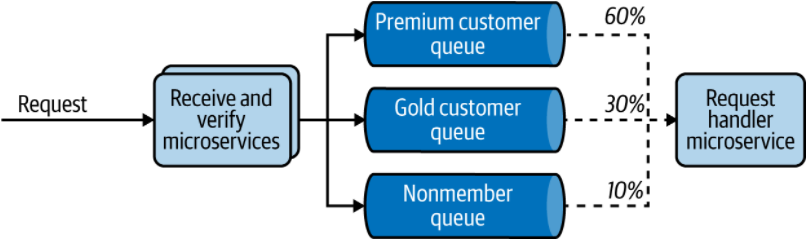

# 云原生介绍

## 认识云原生

> CNCF对云原生定义
>
> 云原生技术使组织能够在现代动态环境（例如公共云、私有云和混合云）中构建和运行可扩展的应用程序。容器、服务网格、微服务、不可变基础设施和声明式 API 是这种方法的例证。这些技术使松散耦合的系统具有弹性、可管理性和可观察性。结合强大的自动化，它们使工程师能够以最少的劳动频繁地、可预测地进行高影响力的更改。

通过云原生应用生命周期的每个阶段, 全面了解云原生的所有特征, 对所有特征做以下定义:

​	*云原生正在将软件应用程序构建为一组独立的、松散耦合的、面向业务能力的服务（微服务），这些服务可以在动态环境（公共、私有、混合、多云）中以自动化、可扩展、有弹性、可管理和可观察的方式。*

使用服务以微服务的形式呈现, 那么什么是微服务呢? 除了微服务还有些什么架构? ---- 请参见更多服务架构

云原生应用除了在开发的时候重要, 在部署发布的时候也很重要. 云原生使用容器化进行部署发布, 如何管理容器的执行和容器的生命周期, 这个就是容器编排的作用.

**为什么要进行容器编排？**

容器编排是容器的生命周期管理. 在真实项目中使用手动管理容器几乎是不可能的. 因此容器编排是云原生架构的重要组成部分, 容器编排具有的一些特征和功能:

*自动配置*

​	自动供应容器实例和部署容器

*高可用性*

​	当一个容器运行时失败时自动重新配置容器

*缩放*

​	根据需求，自动添加或删除容器实例，实现应用的扩容或缩容

*资源管理*

​	在容器之间分配资源

*服务接口和负载均衡*

​	将容器暴露给外部系统并管理进入容器的负载

*网络基础设施抽象*

​	提供网络覆盖以在容器之间建立通信

*服务发现*

​	提供使用服务名称发现服务的内置功能

*控制平面*

​	提供单一位置来管理和监控容器化系统

*亲和力*

​	提供彼此靠近或远离的容器，以提高可用性和性能

*健康监测*

​	自动检测故障并提供自我修复

*滚动升级*

​	以零停机时间协调增量升级

*组件化和隔离*

​	通过使用命名空间等概念在各种应用程序域之间引入逻辑分离

如上的那些功能, 都是容器编排需要具备的能力. 现在Kubernetes已经成为容器编排的标准. 以上真是对运维满满的恶意, 开发啥都不管了.

**自动化开发生命周期**

在谈到云原生时, 交付, 敏捷, 安全很重要. 因此云原生开发过程中, 每一个步骤的自动化是必须要达成的目标. 包括测试, 构建, 发布, 配置, 基础设置管理, CI/CD等. 下图展示云原生的所有阶段:

**动态管理**

云原生应用部署到生产环境中, 并不是一层不变的, 需要对应用进行观察和管理. 下列展示了可能具备的观察和管理功能:

*自动缩放*

​	根据流量或负载扩展或缩减应用程序实例

*高可用性*

​	在发生故障时，提供在当前数据中心生成新实例或将流量转移到不同数据中心的能力

*资源优化*

​	确保资源的最佳使用，动态扩展，没有前期成本，但实时自动响应扩展需求

*可观察性*

​	通过中央控制启用云原生应用程序的日志、指标和跟踪

*服务质量 (QoS)*

​	支持跨应用程序的端到端安全性、节流、合规性和版本控制

*中控平面*

​	提供一个中央位置来管理云原生应用程序的各个方面

*资源配置*

​	管理每个应用程序的资源分配（CPU、内存、存储、网络）

*多云支持*

​	提供跨多个云环境管理和运行应用程序的能力，包括私有云、混合云和公共云（因为给定的应用程序可能需要来自多个云提供商的组件和服务）

## 构建云原生应用的方法论

同样, 任何一种架构都需要方法论, 云原生同样如此. 该方法论并不完全跟以往传统方法论一样. 

有些人认为是使用[The Twelve-Factor](https://12factor.net/), 但是还有一定的差距; 12factor并未覆盖应用开发周期的方方面面.  

因此我们需要一种更完整, 更实用的方法来构建云原生应用. 次方法论分为几个阶段如下图:

下面对每个阶段进行简单的解读:

### 设计应用程序

正在构建一个包含微服务的云原生应用程序时候，不能立即进入应用程序开发。需要围绕您想要迎合的业务来设计应用程序。这需要清楚地识别应用程序必须提供的业务能力以及应用程序需要使用的外部依赖项（服务或系统）。

因此，在设计阶段，应该仔细查看业务用例并确定要构建的微服务。云原生应用的设计可以使用领域驱动设计 (DDD) 方法论，在复杂业务上建立抽象逻辑并在软件组件中表示它们。

DDD 过程从分析业务领域（例如，零售或医疗保健）并在该领域内定义应用特定领域模型的边界开始。这些被称为*有界上下文.* 例如，组织可能具有有限的上下文，例如销售、人力资源 (HR)、支持等。每个有界上下文可以进一步分解为*聚合*，可以被视为单个单元的域对象集群。

这些有界上下文可能会也可能不会直接映射到微服务。当我们设计云原生应用程序时，通常我们可以从每个有界上下文的服务开始，然后将其分解为围绕聚合构建的更小的服务。云原生应用的 DDD 完成后，您还可以在识别微服务的同时确定服务接口/定义和通信风格。

### 开发应用程序

在开发中阶段，我们根据在设计阶段确定的业务用例和服务接口构建应用程序。

### 独立代码库

云原生应用的每个微服务都应该有一个*代码库*在版本控制系统上进行跟踪。服务的多个实例，称为*部署*。因此，你可以将服务部署到不同的环境中，例如开发、测试和生产——所有环境都使用相同的代码库（但它们可能使用不同版本的代码库）。

### 显式依赖

全部微服务的代码级依赖项必须明确声明并相互隔离。依赖项应该在作为微服务代码一部分的清单中声明，并且服务不应该依赖于任何未明确声明的系统范围的依赖项。

### 解耦配置

作为我们之前讨论过，云原生应用程序包含部署到多个环境中的服务的单个代码库。这只有在微服务的配置与微服务代码完全解耦的情况下才有可能。服务的代码库与环境无关，并且配置因部署而异。

### 独立测试

一个微服务应该有独立的测试来独立验证其功能。通常，这些测试是微服务开发周期的一个组成部分，微服务的验证发生在构建和部署阶段。我们可以考虑这些*单元测试* 因为它们被本地化到给定微服务的范围内。

但是，由于云原生应用程序包含多个协同工作以服务于特定业务用例的微服务，因此仅靠单元测试无法测试应用程序的整体功能。我们还需要系统范围的测试，称为*集成测试*. 这些测试将微服务和其他系统收集在一起，并将它们作为一个单元进行测试，以验证它们是否按预期协作，以实现更大的业务能力。另外除了功能性测试以外, 稳定性测试, 性能测试, 故障测试也是必不可少的步骤。

### 容器化

虽然容器化不是构建云原生应用程序的强制性要求，但它在实现其大部分特性和要求方面非常有用。

将云原生应用程序封装到一个包含所有依赖项、运行时和配置的包中是通过容器化实现的。容器化（使用 Docker 等技术）使微服务*不可变*，这意味着它们可以立即启动或停止，并丢弃任何有问题的实例，而不是修复或升级。这要求我们容器化的微服务具有快速启动时间和正常关闭时间。因此，当您利用容器原生框架和技术时，容器化效果最好。（如果由于我们容器化的应用程序的固有限制而无法实现快速启动，Kubernetes 等容器编排系统会提供就绪和活跃度检查，以确保应用程序已准备好为其消费者服务。）

### 连接性、组合和 API

作为我们在本章开头讨论过，云原生应用程序是通过网络通信连接的分布式应用程序。当我们将它们设计为一组微服务时，我们经常需要在这些服务和外部系统之间进行交互。因此，在服务之间建立连接并正确定义 API 和服务接口至关重要。

### 服务主导的互动

全部微服务和应用程序应将其功能作为*服务*公开。同样，微服务消耗的任何外部能力和资源也应声明为服务（通常称为*后备服务）*）。

服务的概念是一种抽象这在很多方面有助于微服务交互。服务是动态服务发现的推动者，保持服务元数据的存储库/注册表。它还允许您实现负载平衡等概念。这就是为什么将服务抽象作为一流抽象构建到容器编排平台中的原因。因此，当您使用一组微服务构建云原生应用程序时，可以将其能力声明为服务。我们消费的任何外部应用程序/服务或资源（例如数据库或消息代理）也应该声明为我们可以通过网络消费的服务。

### 服务间通信和组合

服务交互与其他系统之间是云原生应用开发的关键部分。这些交互使用各种通信模式和协议通过网络进行。这些交互可能涉及使用多个服务、创建组合、创建基于事件的消费者或生产者等。我们还必须构建某些功能——例如应用程序级安全性、弹性通信（断路器、带有退避和超时的重试逻辑）、路由、发布指标和可观察性工具的跟踪——作为服务间通信逻辑的一部分，尽管它们并不是业务逻辑的真正组成部分。

### 将功能公开为API

对于某些能力，服务的概念可以进一步扩展到*托管 API*的概念. 由于云原生应用程序的大部分业务能力都可以暴露给外部和内部各方，因此我们希望使其成为托管服务/API。这意味着您可以使用 API 网关和管理平面 （API 管理/控制平面）实现功能（您向消费者公开的 API），例如安全性、节流、缓存、版本控制、货币化（从公开的 API 中创造收入）、启用开发人员门户等.

该*API网关*充当您能力的前门和*开发人员门户*可以围绕您的 API 建设生态系统。API 管理应该针对服务的外部和内部消费进行。但是，API 管理并未内置于 Kubernetes 等容器编排平台中。因此，您需要明确使用 API 管理技术将您的微服务公开为托管 API.

### 自动化开发、发布和部署

正如我们所指出的 在本章前面，将开发、发布和交付过程中尽可能多的步骤自动化是构建云原生应用程序的重要部分构建云原生应用程序的各个阶段（例如测试、代码推送、构建、集成测试、发布、部署和运行）应该通过使用持续集成、持续部署、和持续交付技术和框架实现自动化。

### 在动态环境中运行

在运行云原生应用程序的阶段，您可以设置要在执行环境中部署和执行的应用程序，作为上一阶段的一部分。这里的关键思想是确保您的应用程序独立于执行环境，并且可以在各种执行环境（开发、测试、生产等）中执行，而无需对应用程序代码进行任何更改。由于您使用容器作为交付模型，因此执行运行时通常包含一个容器编排系统。执行环境可以是本地环境；公共、混合或私有云；甚至多个云环境。

### 动态管理的控制平面

它允许您控制应用程序正在运行的动态环境的行为。该控制平面是 DevOps 和在运行时环境中运行应用程序的开发人员之间的主要交互点。通常，此类云控制平面由 Web 界面和代表性状态传输组成 (REST) 或远程过程调用(RPC) API。大多数云提供商都提供此类控制平面作为其云服务产品的一部分。

### 可观察性和监控

一旦部署应用程序后，构建云原生应用程序的下一阶段是观察它们的运行时行为。在软件应用程序的上下文中，*可观察性*是指无需部署任何新代码即可理解和解释系统状态的能力。这对于故障排除、记录业务交易、识别异常、识别业务模式、生成洞察等至关重要。

在可观察性和监控阶段，需要在云原生应用程序中启用关键的可观察性方面。其中包括日志记录、指标、跟踪和服务可视化。工具是为这些方面中的每一个明确构建的，大多数云提供商都将这些功能作为托管云服务提供开箱即用。从应用程序代码级别，可能必须在不更改应用程序代码的情况下启用代理或客户端库。

## 用于构建云原生应用程序的设计模式

云原生设计模式到底是什么, 到底有哪些模式, 解决什么问题这个接下来我们要讨论的内容.简单介绍模式如下:

### 沟通模式

云原生应用程序由一组分布在网络中的微服务组成。云原生*通信模式*都是关于这些服务如何相互通信以及与外部实体通信。

即使是构建一个非常简单的业务用例，您的应用程序也需要使用外部服务（例如，可以是另一个服务、数据库或消息代理）。因此，构建您的应用程序与这些外部服务之间的交互正成为构建云原生应用程序中最常见但最复杂的任务之一。

分布式计算世界的大多数传统服务间通信模式和技术都不能直接应用于云原生应用程序开发的上下文中。我们需要选择非常适合应用程序的云原生属性（例如，允许服务自主性和可扩展性的模式）以及业务用例（例如，一些可能需要交付保证，而另一些可能需要实时响应）。

云原生应用程序之间的服务间通信使用同步或异步通信模式实现。在*同步通信中*，我们使用请求/响应和 RPC 等模式。在*异步通信中*，我们使用诸如基于队列和发布者-订阅者 (pub-sub) 消息传递等模式。在大多数实际用例中，您需要同时使用这两个类别来构建服务交互。当涉及到通信模式时，服务接口定义和契约也起着至关重要的作用，因为它们是表达如何使用给定服务的标准方式。

除了服务到服务的交互之外，某些云原生应用程序可能必须与外部方（例如前端客户端或支持服务）进行通信。作为应用程序开发人员，您需要处理大量活动部件并与外部服务和系统进行大量交互。

### 连接和组合模式

你拥有的微服务越多，服务间的通信就越多。因此，在设计云原生应用时，需要引入某些能力和抽象，以降低服务间通信的复杂性。这就是*连接和组合模式*出现的地方。

#### 连通性

在上下文中在服务间通信中，*连通性*是指在服务之间建立可靠、安全、可发现、可管理、可观察的通信通道。例如，当给定服务调用另一个服务时，您需要应用某些可靠性模式，例如重试或建立安全通信通道。它们不是应用程序业务逻辑的一部分，但对于构建强大的连接至关重要。

#### 组合模式

建造时在云原生应用程序中，通过管道或集成一个或多个其他服务或系统来创建服务是很常见的。这些称为*组合*（也称为*组合服务*和*集成服务*）。

在SOA通常是通过ESB进行组合。在这个架构中使用了大量的组合模式，它们通常被称为*企业集成模式*（*EIP*）。

但是，在云原生时代，我们不使用中央组合层。所有这些任务都需要作为我们开发的服务的一部分来完成。

### 数据管理模式

云原生应用程序需要处理一些数据管理。您的应用程序通常由充当持久存储的数据库支持，以存储应用程序状态或构建服务所需的业务数据。正如您之前了解到的，云原生应用程序本质上是分布式的。因此，数据管理也是以完全分散的方式进行的。

在常规单体应用程序，我们曾经有一个中央共享数据存储，许多应用程序与之交互。对于云原生应用程序，我们让给定的微服务拥有自己的数据存储，外部各方只能通过该服务接口与其交互。使用这种隔离的数据管理方法，在微服务之间访问、共享和同步数据变得具有挑战性。这就是为什么了解云原生数据管理模式对于云原生应用程序开发至关重要。

### 事件驱动架构模式

当我们讨论云原生通信模式，我们讨论了异步消息传递作为服务间通信技术。这是事件驱动的云原生应用程序的基础。数十年来，*事件驱动架构*( *EDA* ) 已广泛用于应用程序开发。在云原生应用程序的上下文中，EDA 起着至关重要的作用，因为它是启用自主微服务的好方法。与查询或 RPC 等同步通信技术不同，EDA 实现了更加解耦的微服务交互。

### 流处理模式

在 EDA 中，我们处理一次只有一个事件。换句话说，微服务的业务逻辑是为了一次处理一个事件而编写的。后续事件之间没有相关性。一个*流*另一方面，是随着时间的推移可用的一系列事件或数据元素。这些事件由应用程序以有状态的方式处理。

这种微服务的实现和部署架构与事件驱动的微服务发生了巨大的变化，因为它必须处理状态、进行高效的数据处理、管理各种扩展和并发语义等。

### API 管理和消费模式

在大多数中等或云原生架构的大规模用例，您必须将应用程序的某些业务能力暴露给应用程序范围之外的外部或内部方。您需要公开诸如托管服务或 API 之类的功能. 这使您可以更好地控制外部各方如何使用这些功能，并使外部各方能够轻松发现这些 API 并提供反馈。

公开这些功能通常是通过使用单独的 API 网关层来完成的，该层充当您公开的所有 API 的前门。API 网关还包括围绕公开的 API 构建的管理平面和开发人员门户。

## 云原生应用参考架构

参考架构包含多个使用不同通信模式进行通信的微服务。每个服务都可以使用自己的数据或持久存储，并且还有一个共享的或私有的事件代理基础设施。微服务之间的交互代表了我们可以实现的所有通信模式。每个通信链路都可以通过使用与可靠性、安全性、路由等相关的连接模式来实现。

# 通信模式

随着微服务的激增和不断增长的业务需求，在云原生应用程序中在微服务之间建立强大的通信是云原生架构中最困难的挑战之一。

## 同步消息模式

### 请求-响应模式

基本最常见的同行模式, 应用最多的为Restful. 具体内容不在本文详述.

### RPC模式

它使分布式应用程序能够调用远程应用程序的过程——就像进行本地过程调用一样。一个给定的微服务可以将特定的业务逻辑构建为一个函数，并使其可供驻留在单独进程中的消费者进行远程调用。在Kubernetes也大量应用RPC调用, 先比较Restful而言, 具有更高性能, 更低资源. 但是同样具有了更强的耦合性.

简单过程介绍如下图:

现在也有多数组件提供gRPC的跨语言支持, 进一步减少了耦合性. 具体如何选择, 需要根据业务的要求例如: 数据量, 语言平台, 变更频率, 时延要求, 指标要求等.

## 异步消息传递模式

在云原生项目中, 通常提供集中式的消息组件来构建基本的消息系统, 而应用通过对消息平台的访问达到传递消息的目的. 大约有以下几种消息使用模式:

### 单接收器模式

在*单接收器模式中*，给定的微服务将消息准确地传递给一个目标微服务，或者传递给使用消息传递基础设施（如消息代理）的系统。此处发送的消息通常被视为*命令，*因为该模式可确保将消息传递给应该处理它们并执行操作的单个使用者。

典型应用示例:

有许多不同的消息组件均能够满足要求, 具体选择哪个需要根据业务类型, 数据量, 技术背景等做选择.

### 多接收器模式

基于单一消费者的异步当您有一个消费者来使用您发布到消息代理的消息时，消息传递工作。如果您必须向对特定事件感兴趣的多个消费者发送相同的消息怎么办？

### 异步请求-回复模式

请求回复模式通常是单接收模式的变体, 通过两段的发送和监听达到请求回复的要求, 如下图:

### 服务定义模式

建造时云原生应用程序之间的通信，需要考虑的最重要的方面之一是*服务定义——*你如何定义你的微服务接口给它的消费者。

#### 同步通信中的服务定义

当我们构建同步服务时，我们可以将服务定义发布到称为*服务注册*中心的中心位置. 这是其他微服务和开发人员可以与之交互的元数据存储库。在定义服务接口时，您可以从多种技术中进行选择，具体取决于您用于同步通信的通信协议（例如，RESTful、gRPC 等）。

#### 异步通信中的服务定义

在异步通信，生产者和消费者之间交换的消息包含使用*模式*序列化或反序列化的结构化数据定义和验证各方之间交换的数据。由于通信是通过消息代理或事件总线异步发生的，因此生成和使用消息的微服务应该使用通用模式。类似于同步消息场景中的服务定义，生产者和消费者微服务必须使用集中数据来存储模式。

实现同步消息传递模式技术常见的有:

RESTFul, GraphQL, WebSocket, gRPC, 

异步消息常见的有:

AMQP, Kafka, RabitMQ, RockatMQ, ActiveMQ, MQ, NATS等

## 常见运行方式

在同步通信中，选择标准方式如OpenAPI等，定义开放的标准的业务接口。然后将接口统一注册在注册中心，例如：Dubbo。基于标准的服务可以生成必要代码，文档。除RESTFul以外gRPC，GraphQL也是常用的选择，基于性能，业务模型，现有存量，等进行选择。

# 连接模式

## 服务连接模式

云原生应用程序本质上是通过服务间通信连接的分布式微服务集合。在构建真实世界的云原生应用程序时，建立服务间连接、集成多种服务以创建业务能力并将这些连接的服务呈现为托管能力至关重要。

该*服务连接模式*是一种高级复合模式，可用于构建云原生应用程序。该模式解释了如何通过连接微服务和现有系统来形成云原生应用程序，以及这些服务如何与应用程序的使用者交互

现实当中，几乎所有的程序都使用服务连接。多业务模型下会使用多种连接方式，比如：需要进行查询的同步模式。需要做通知的异步模式。典型的实践应用方式如下：

## 服务抽象模式

什么时候云原生应用程序中的微服务需要与另一个微服务或外部系统进行交互，最好使用一种抽象来隐藏底层实现、位置和部署结构的细节。这是*服务抽象模式*背后的关键思想。这种模式使用一个服务来抽象一个或多个底层服务。

典型的用例, 在K8S中, 使用Service对后端Pod进行抽象, 而不是直接访问Pod的IP. 在K8S集群中，POD是一种瞬时状态，所有的IP，名称都不是固定值，因此如果直接对POD进行访问，往往不可达，或者变更成本很高。因此，按照架构的典型做法*抽象*。使用服务抽象的好处包括：

- 允许使用固定的IP（例如Service的IP）表示我的服务
- 使用内置的服务发现能力
- 无缝提供负载均衡和故障转移
- 缩放时对抽象是可持续的访问

再更近一步, K8S对所有的服务再进行一次抽象, 通过外部的负载均衡器完成对所有Pod的负载均衡, 如下图:

## 注册和发现模式

因为服务是分布式的，需要一个地方来保存服务的信息。客户端可以通过访问服务注册API来获取服务信息。服务提供者可以通过提供服务的详细新来来注册服务。可以通过两种方式来实现注册和发现模式。

- 客户端服务发现

存储在服务注册中心的服务可以是服务定义或者规范，消费者获得这些信息便可以调用相应的服务。

- 服务端发现

客户端的请求到达负载均衡器，由负载均衡器引用相应的服务。负载均衡器从存储中检索出服务信息，并调用。

在实践中有常用的有包括Consul，Kubernetes中基于DNS的服务，Nacos等，需要根据需要选择。

### 常见运行方式

在实践当中，由众多微服务组合起来提供业务能力，微服务之间可以是链式一个接着一个，可以是并行式的，更多的是链式和并行式组合的。如果某个微服务不能提供服务，可能会引起所有的业务都不可用，因此需要考虑有微服务丢失或异常情况下，如何进行业务的处理。

在考虑服务具有弹性特性时，需要考虑的情景如下：

- 超时

  在链式调用中，超时时间是所有链路上的时间消耗的总和，在并发调用中，超时时间是时间消耗最多服务时间。因此如何设置超时时间，需要根据服务拓扑和微服务时间来定义。 在业务中，设置适当的超时时间是必要的，所有的服务不可能无限制的等待下去。

- 重试

  基于错误设计原则，部分微服务不可用时，需要考虑重试的场景

- 截止日期

  是超时的一种变形体，没有服务提供者在收到请求时，会收到来自请求的截止时间。如果截止则快速错误返回；如果有下一个链路，则根据当前的耗时估计计算下一个服务的截止日期，将所有的截止日期在整个链路上传递。

  

- 熔断

  在微服务中，如果目标服务失败情况下，再进一步调用可能会引起更多的失败和级联故障。因此我们可以引入一个熔断器，如果先前的调用失败并且状态达到某个阈值，则熔断器会阻止对目标服务的进一步调用。

  

- 快速失败

  分布式计算中，快速的故障响应被认为比缓慢的故障响应要好得多。*快速失败*背后的关键思想 是尽快检测与服务连接相关的任何故障或异常。弹性通信逻辑可以通过这样一种方式实现，即我们在将请求发送到目标服务之前验证请求，这样我们就可以在不调用目标服务或系统的情况下检测任何故障

## 边车模式

边车模式是在主服务容器里面在附加一个容器，用于控制对外连接的方式。

使用Sidecar进行通信时，服务的业务逻辑不关注底层的网络通信，此部分全部托管给Sidecar来执行。所有的网络流量例如：安全，路由，服务发现等，都托管给Sidecar来进行。

在实践中，Kubernetes往往将一个Pod使用两个容器，一个为业务一个为sidecar，可以使用手动注入或者自动注入。业务和控制面相互隔离。常用的模式包括边车代理和边车桥方式：

- 边车代理

  

- 边车桥

  

  Sidecar模式作为云原生应用开发的主流模式之一，它带来的能力可以极大地增强和扩展主容器，但是这种模式是有代价的，包括：

  - 增加微服务实例
  - 容器管理需要有专门的控制平面来完成
  - 额外的配置复杂功能带来的更复杂的配置管理逻辑
  - 需要将控制面与业务面隔离

## ServiceMesh模式

服务网格是Sidecar的扩展，用作云原生程序通讯栈的基础设施。

在服务网格中，边车代理负责与所有的外部进行通讯，边车与业务容器作为一个服务单元，比如：在同一个Pod中，示例：

在现实中，Istio和Linkerd是使用较多的组件，提供了自己的配置语言和API。

## Sidecarless模式

服务网格需要为您在云原生应用程序中运行的每个微服务实例提供一组 sidecar 代理。这是服务网格模式采用缓慢的原因之一。该*Sidecarless服务网格*试图通过消除对边车需要解决这个问题。该模式的应用仍处于早期阶段，但由于其独特的优势，在微服务连接的背景下，它是一个非常有前途的模式。

如果控制平面可以管理和控制Sidecar代理的网络通信，为什么不直接使用主容器的客户端组件来做呢？将控制平面嵌入到主服务容器，并不是相互独立，对网络复杂度，业务复杂度都有帮助。比如：

在现有的云服务中Google Traffic Director提供了此种模式的能力，但是暂无成熟的开源件提供此项业务能力。

连接模式总结：

| 名称                 | 何时使用                                                     | 什么时候不使用                                               |
| :------------------- | :----------------------------------------------------------- | :----------------------------------------------------------- |
| 服务连接             | 这是一种通用模式，可用于在几乎所有云原生应用程序中构建连接。 | （不适用。）                                                 |
| 服务抽象             | 通常，如果您使用的是 Kubernetes 或云服务，则需要显式使用它。 当您将云原生应用程序与现有的单片系统连接时很有用。 | 当您完全依赖云服务或无服务器平台时，不需要专门使用此模式。   |
| 服务注册和发现       | 如果您有几十个服务被组织内外的广泛客户使用，则需要一个成熟的服务注册和发现解决方案。 对于大多数用例，Kubernetes 等平台提供的基础服务注册和发现就足够了。 如果您使用 AWS、Azure 或 GCP 等云服务，则大多数功能都是开箱即用的。 | 如果您需要连接的服务数量很少，那么拥有一个成熟的服务注册和发现服务是没有意义的。 您仍然需要一个原始的服务发现机制（例如 DNS）来封装服务位置和部署细节。 |
| 服务弹性             | 在构建与多个服务和系统连接的可靠云原生应用程序时经常需要。 将遗留系统与云原生应用程序连接起来必不可少。 如果底层云服务或部署（例如，服务网格）不支持弹性连接，则明确实施弹性。 | 如果您在服务网格、云服务或使用无服务器平台之上构建应用程序，则不需要显式使用（它们在大多数情况下为弹性连接提供开箱即用的支持）。 |
| 边车                 | 当您必须将业务逻辑与连接逻辑分离时很有用。 如果连接逻辑太复杂，将其卸载到单独的运行时是有意义的。 您使用需要相同连接功能的多语言技术。 | 如果您的 DevOps 没有能力处理 Sidecar 架构的复杂性，则不适合。 如果您不使用容器编排，那么支持 Sidecar 架构将非常复杂。 |
| 服务网格             | 您必须连接众多微服务以实现弹性、流量路由、安全通信、服务发现和可观察性。 | （与 Sidecar 模式相同。）                                    |
| Sidecarless 服务网格 | 如果 sidecar 架构阻碍性能，则很有用。 底层实现技术支持与控制平面的无边交互。 | 仍处于非常早期的阶段。因此，除非该模式由技术堆栈或云提供商（例如，GCP Traffic Director）提供，否则最好避免使用它。 |

# 组合模式

*服务组合*就是关于如何通过管道或集成多个服务和系统来实现业务用例。重要的是要记住，我们构建的服务使用现有服务，并且应该具有明确的业务范围并由明确的业务需求驱动。我们不能简单地通过随机连接来创建复合服务。例如，如果你想支持某种业务能力（比如订单管理），你应该想出组合服务的API以及你想集成的下游服务和系统。接下来我们将讨论三种常见的服务组合模式：服务编排、服务编排和 Saga。

## 服务编排模式（Orchestration）

在上例中，需要在Order Service中定义如何调用其他组合服务，在使用服务编排时需要有以下注意事项：

- 如果它可以直接映射到聚合其他几个下游能力的能力的业务能力，则使用此模式。否则，您将创建具有多种业务功能的单一服务。
- 服务编排很容易在无状态的场景中实现，因此我们无需担心保留编排的状态。
- 最好限制组合中的服务调用次数。例如，如果您必须在超过四个或五个服务之间编排调用，则表明该服务存在业务范围问题，或者下游服务可能过于精细。
- 服务编排将组合逻辑集中到单个服务中，并且该服务与其连接的所有下游服务紧密耦合。

## 服务规划模式（Choreography）

通过消息代理创建异步事件驱动的通信链来构建一个完整的服务体系。交互逻辑分散在多个服务中，微服务之间不存在直接耦合。与编排模式不同，微服务不会直接调用其他微服务，而是根据进入服务的事件和消息，以响应模式运行。此种方式也叫做反应式微服务，与事件驱动架构模式密切相关。如图示：

使用服务规划方式的注意事项包括：

- 服务组合逻辑分散在多个微服务中。与服务编排不同，您无法仅通过查看单个服务来了解编排场景的业务逻辑。
- 服务是松耦合的。与服务编排相比，使用服务编排模式添加或删除服务要容易得多。
- 由于服务编排模式的事件驱动和异步特性，您可以使用无服务器平台来实现它。例如，您可以将所有事件驱动的微服务建模为无服务器功能。

## Saga模式

在某些场景由多个微服务共同构建的业务服务中，我们需要以事务的方式执行访问。比如：一个微服务失败，那么其他链路上的所有微服务都应该做响应的回滚。由于此类场景的事无边界是跨越多个微服务的，甚至是跨越多个系统的，此种方式呗叫做分布式微服务。

Saga模式提供一个方法来构建跨越多个服务的分布式事务。通过使用相应的补偿操作来撤销作为单个分布式事务的每个节点来实现。Saga可以应用于上面提到的编排和规划。实例：

Saga 模式将这种分布式事务场景分解为多个本地事务，并将它们组合在一起以执行并引入补偿操作以回滚每个子事务。在上图中，分布式事务，每个下游微服务都可以执行本地事务（例如以事务方式向数据库添加数据或向队列发布消息）。为了回滚这些本地事务，每个微服务都提供了一个*补偿操作*.

让我们看一个旅行预订服务的真实用例。假设我们需要构建一种业务能力，允许客户在一次交易中预订他们的航空公司、酒店和汽车租赁。航空公司、酒店和汽车租赁功能被实现为微服务。每个服务都执行自己的本地事务，例如将航空公司预订添加到数据库、将酒店预订发布给经纪人以及将汽车租赁预订添加到数据库。

框架和工作流引擎例如：Camunda和Apache Camel等支持使用无服务函数和事件代理来实现Saga模式。

注意事项：

- Saga 模式的实现需要 Saga 框架或工作流引擎解决方案来支持服务之间的业务事务的有状态执行（即 Saga Execution Coordinator）。由于涉及的复杂性，通常不建议从头开始实施所有内容。
- 运行可观察性 解决方案与 Saga 实现是必不可少的，因为我们必须跨分布式服务调试和解决复杂的业务事务。
- Saga 实现框架应该由可扩展的分布式日志支持，因为单个事务可能会向 Saga 日志发出大量事件。

# 数据管理模式

数据是所有应用程序的关键，即使是最简单的应用也是依赖于数据的传递完成的。在数据架构中，将说明应用收集、处理和存储数据；然后根据数据在应用中的使用方式、结构和规模将数据进行分类。

## 数据架构

云原生应用程序应该能够以满足我们用例的方式收集、存储、处理和呈现数据

Data stores作为架构的关键部分，以各种格式和大规模的存储数据，作为报告的来源，作为API的基础。

Real-time/stream作为动态处理事件提供服务，并在事件发生时提供告警和通知。

由于云原生微服务具有可扩展、弹性和可管理等特性，云原生*数据*具有与传统数据处理实践截然不同的独特特性。最重要的是，云原生数据可以以多种形式、多种数据格式和数据存储进行存储。他们不应该保持固定的模式，并鼓励他们拥有**重复**的数据，以提高可用性和性能而不是一致性。此外，在云原生应用程序中，不鼓励多个服务访问同一个数据库；相反，他们应该调用拥有数据存储的相应服务 API 来访问数据。所有这些都提供了关注点分离并允许云原生数据横向扩展.

## 数据类型和形式

数据类型

- *输入数据*

​		发送作为用户或客户端输入消息的一部分。最常见的是，这些数据是 JSON 或 XML 消息，尽管 gRPC 和 Thrift 等二进制格式正在获得一些关注。

- *配置数据*

​		假如由环境作为变量。XML 长期以来一直被用作配置语言，现在 YAML 配置已成为云原生应用程序的事实标准。

- *状态数据*

​		数据由应用程序本身根据当前时间之前发生的所有消息和事件存储的关于其状态的信息。通过持久化状态数据并在启动时加载它，应用程序将能够在重新启动时无缝恢复其功能。

数据形式

- *结构化数据*

  能适合预定义的模式。例如，典型用户注册表单上的数据可以方便地存储在关系数据库中。

- *半结构化数据*

​		拥有某种形式的结构。例如，数据条目中的每个字段可能都有一个对应的键或名称，我们可以使用它来引用它，但是当我们取所有条目时，并不能保证每个条目将具有相同数量的字段甚至是公共的键。这些数据可以很容易地通过 JSON 表示, XML, 和 YAML 格式。

- *非结构化数据*

​		做不包含任何有意义的字段。图像、视频和原始文本内容就是示例。通常，这些数据是在不了解其内容的情况下存储的。

## 数据存储

- 关系型数据

- NoSQL

- 文件系统存储

## 数据管理

### 集中数据管理

### 去中心化数据管理

### 混合数据管理

## 数据组合模式

更进一步，可以对数据库进行抽象，独立出单独的数据服务如图：

## 复合数据服务模式

通过组合来自多个数据服务的数据来执行数据组合，并在需要时执行相当复杂的聚合以提供更丰富、更简洁的响应。这种模式也称为*服务器端混搭模式*，因为数据组合发生在服务而不是数据消费者。

## 客户端混搭模式

## 数据扩展模式

云原生应用程序的负载增加，无论是服务还是存储都可能成为瓶颈。在这里，我们将看到如何缩放数据。当数据可以归类为大数据时，我们可以使用 NoSQL 数据库或分布式文件系统。这些系统完成了数据扩展和分区的繁重工作，并降低了开发和管理的复杂性。

### 数据分片模式

- 水平分片

  每个shard 具有相同的模式，但包含基于其分片键的不同数据记录。基于这些分片键将数据库中的表拆分为多个节点。

​														                 	

- 垂直分片

- 功能数据分片

云原生应用程序可以使用所有三种方法来扩展数据，但垂直和功能分片可以隔离数据的程度是有限的。最终，需要引入水平数据分片来进一步扩展数据。当我们使用水平数据分片时，我们可以部署以下技术之一来定位我们存储数据的位置：

*基于查找的数据分片*

查找服务或分布式缓存用于存储shard key的映射和物理数据的实际位置。检索数据时，客户端应用程序将首先检查查找服务以解析预期分片键的实际物理位置，然后从该位置访问数据。如果数据稍后重新平衡或重新分片，客户端必须再次查找更新的数据位置。

*基于范围的数据分片*

这个特别当分片键具有连续字符时，可以应用分片方法。数据在范围内共享，并且与基于查找的分片一样，查找服务可用于确定给定数据范围的可用位置。这种方法为基于日期和时间的分片键产生了最佳结果。例如，一个月的数据范围可能驻留在同一个分片中，允许服务一次性检索所有数据，而不是查询多个分片。

*基于哈希的数据分片*

建设基于数据字段的分片键或按日期范围划分数据可能并不总是会产生平衡的分片。有时我们需要随机分布数据以生成更平衡的分片。这可以通过使用基于散列的数据分片来完成，它基于分片键创建散列并使用它们来确定分片数据的位置。这种方法在查询范围内的数据时不是最好的，但在查询单个记录时是理想的。在这里，我们还可以使用查找服务来存储哈希键和分片位置映射，以方便数据加载。

### 读写分离模式

*命令查询职责分离*( *CQRS* )*模式*将数据集的更新和查询操作分开，并允许它们在不同的数据存储上运行。这导致更快的数据更新和检索。它还有助于建模数据以处理多个用例，实现高可扩展性和安全性，并允许更新和查询模型以最少的交互独立发展。

## 性能优化模式

提高性能的一种原始方法是通过索引数据。尽管这提高了查找性能，但过度使用索引会损害读取和写入性能。每次写操作都需要更新所有索引，导致数据库执行多次写操作。同样，在读取方面，数据存储可能无法加载所有索引并将它们保存在内存中。每个查询可能需要执行几个读取操作，从而导致更多时间来获取数据。

数据非规范化也是一种简化读取模型的好技术，因为它可以消除对连接的需求并大大提高读取性能。当我们将此方法与 CQRS 模式相结合时，这可能特别有用，因为编写者可以使用规范化数据存储来保持高度一致性，同时允许查询高效地从非规范化数据中读取。

除了这些简单的技术之外，让我们讨论如何通过将数据移近执行、将执行移近数据、减少传输的数据量或存储预处理数据以供将来使用来提高性能。本节将详细讨论此类模式。

### 物化视图

通过将数据移近执行并预填充物化视图，提供在查询时有效检索数据的能力。此模式将服务的所有相关数据存储在其本地数据存储中，并以最佳方式格式化数据以服务查询，而不是让该服务在需要时为数据调用相关服务。

这种模式异步从依赖服务复制数据。如果数据库支持异步数据复制，我们可以将其用作将数据从一个数据存储传输到另一个数据存储的一种方式。如果做不到这一点，我们需要使用事件溯源模式并使用事件流来复制数据。源服务将每个插入、删除和更新操作异步推送到事件流，然后它们被传播到构建物化视图的服务，在那里它们将获取数据并将其加载到本地存储中。

### 数据局部性

*数据局部性模式*的目标是使执行更接近数据。这是通过将服务与数据共同定位或通过在数据存储本身中执行来完成的。这允许执行以更少的限制访问数据，有助于加快执行速度，并通过发送聚合结果来减少带宽。

### 缓存模式

在*缓存模式*将先前处理或检索的数据存储在内存中，并为将来发出的类似查询提供这些数据。这不仅减少了服务中重复的数据处理，而且还消除了当响应已经存储在服务中时对依赖服务的调用。

缓存也可以用来实现高可用，尤其是当服务可用性比数据的一致性更重要的时候。即使后端数据存储不可用，我们也可以使用缓存数据处理服务调用。我们还可以通过使本地缓存回退到共享或分布式缓存扩展此模式，当数据不存在时，后者又可以回退到数据存储。此模式可以包含弹性连接模式使用上文讨论的用于回退调用的断路器，以便当后端在失败后可用时，它们可以重试并优雅地重新连接。

在每个本地服务使用各自缓存时，可能会造成缓存数据不一致的情况，并且各自缓存服务的失效时间刷新时间也各不相同，因此可以通过消息系统进行通知，让各个节点的缓存进行刷新。

或者使用第三方服务，将缓存与数据集中打包成一个独立服务由API方式提供：

### 静态内容托管

云原生 Web 服务用于根据客户的请求创建动态内容。一些客户端，尤其是浏览器，需要大量其他静态内容，例如静态 HTML 页面、JavaScript 和 CSS 文件、图像以及用于下载的文件。这种模式不是使用微服务来满足静态内容，而是允许我们直接从存储服务（例如内容交付网络）提供静态内容 （CDN）。

## 可靠性模式

数据任何关键业务应用程序都不能容忍丢失，因此数据的可靠性至关重要。在修改数据存储和在应用程序之间传输数据时应用相关的可靠性机制至关重要。本节概述了使用事务可靠性模式来确保可靠的数据存储和处理。

### 事务模式

使用事务将一组操作作为单个工作单元执行，因此所有操作都作为一个单元完成或撤消。这有助于维护数据的完整性，并防止服务执行错误。这对于成功执行财务应用程序至关重要。

此模式将多个单独的操作包装成一个大操作，从而保证所有操作或任何操作都不会成功。所有交易都遵循以下步骤：

1. 系统启动事务。

2. 执行各种数据操作操作。

3. Commit 用于表示事务的结束。

4. 如果没有错误，则提交成功，事务将成功完成，更改将反映在数据存储中。

   如果有错误，事务中的所有操作都会回滚，事务就会失败。数据存储中不会反映任何更改。

当我们想从一个事件中消费一个事件时，可以使用这种模式队列，在此基础上对数据存储执行更新，并将该消息传递到另一个事件队列以进行进一步处理——所有这些都在一个事务中，如下图，为了在多个系统之间同步操作，我们可以使用 XA使用两阶段提交协议的事务。大多数数据库和事件队列系统也原生支持 XA 事务，通过这个我们可以确保即使处理系统在执行过程中发生故障，事件也不会丢失。

## 安全性：Vault 密钥模式

该*库主要模式*提供了对数据存储的直接访问通过可信的道理，通常称为的*Vault-Key*。一些流行的云数据存储支持此功能。

# 事件驱动模式

*事件驱动架构*是一种基于事件促进生成、检测、消费和反应的软件架构范式。事件驱动的架构允许我们构建分布式和可扩展的云原生应用程序。与本质上大多是同步的服务组合模式相比，事件驱动架构是异步的。它们为设计云原生应用程序提供了一种干净且解耦的方式，允许更简单的扩展，并且是构建大规模分布式云原生应用程序的基础架构之一。

## 事件驱动架构

与同步通信模式不同，在事件驱动架构中，我们不能总是直接向消费者发送消息并获得他们已成功消费的确认。在大多数情况下，我们需要消息代理等中间系统来消费、存储和传递事件给他们的消费者，同时确保不会因系统故障而丢失任何事件。消息代理 提供不同的事件传递保证，如下：

*最多一次交付*

事件只交付给消费者一次或根本不交付给消费者。如果在交付尝试期间消费者不在线或发生网络故障，消费者将不会收到该事件。最重要的是，消息代理不会再次尝试发送相同的事件。

*至少一次交付*

事件保证交付给消费者。但是，消费者可能会多次消费同一个事件，因为如果消息代理没有从消费者那里得到事件传递的确认，它将假定消费者没有收到该事件并重新发送它。在这种情况下，消费者应该足够聪明以处理重复事件。

由于网络和系统的不稳定性，我们无法实现有且仅有一次事件保证。为此，我们在实现业务的时候要保证事务的幂等性，从而达到有且仅有一次的事务保证。特别是在做数据变更类业务时，尤其需要保证。

## 事件架构

最多 常见的事件数据格式是 JSON 和 XML, 但二进制格式如 Avro 和 Protobuf在高性能场景中也越来越受欢迎。无论您选择哪种格式，您都应该始终对模式进行版本控制，以便有效地传达和管理对格式的更改。您还应该尽可能使用模式注册表来存储所有事件模式，以便消费者可以按需获取模式来解释事件。例如，Apache Kafka 是一个消息代理，它支持基于 Avro 的事件和模式注册表。

### 事件传递模式

- 生产消费模式

  在*生产者-消费者模式*使生产者应用程序和消费者应用程序能够使用事件队列进行异步通信。队列管理哪些消费者处理哪些事件，以及当消费者在事件处理过程中失败时需要遵循哪些程序。

  

  生产消费提供了异步事件传递能力，使用单个应用处理单个事件，直到消息被消费一次，事件队列才会清空。如果在发送过程失败，组件应提供重发的机制。另外，还可以以此种方式来完成削峰填谷的作用，使用队列消费限制完成对后端业务压力的平滑处理。再结构对消息本身的路由均衡也完成对压力的平均分担。

- 发布订阅模式

  此模式使用*主题*将事件从发布者传播到订阅者。该主题是一个消息代理概念。多个发布者可以向消息代理中托管的主题提交事件。然后该主题将所有这些事件发布给它的所有订阅者，并确保每个订阅者都接收到所有传入事件。

  

  该模式的标准行为是尽力而为：事件最多传递一次。当订阅者由于不可用或网络故障而错过事件时，他们将永远不会收到该事件。但是我们通过*持久订阅*克服了这个问题，这保证所有消息至少传递给所有消费者一次，考虑到暂时不可用的订阅者。

  根据不同的消息策略，可以将广播消息传递给指定的消费者。

- Fire-Forget模式

  此模式够在不使用消息代理的情况下向各自的消费者（服务）发送事件，并保证最多一次交付。这种模式使用标准 API 发送事件。

  当我们需要尽最大努力交付非关键数据时，或者当接收服务不具备从客户端订阅或拉取事件的能力时，这种模式很有用。

  对于一些具有时效性的数据时，此种模式很有用，使我们能够快速丢弃事件并选择下一个事件进行处理。如果我们不想在事件无法交付时丢弃它们，我们应该使用生产者-消费者模式。

- 存储转发模式

  在*存储转发模式*使客户端能够通过至少一次交付保证向服务发送事件。与 Fire and Forget 一样，此模式不使用消息代理，而是使用 API 直接发送事件。

  这种模式需要复杂的客户端设计来实现至少一次的事件传递保证。此模式中的客户端首先将事件持久化到持久存储，例如消息代理中的数据库或队列，然后再尝试将它们发送到服务。成功传递事件后，客户端从存储中清除事件。如果传递不成功，它会重试发送事件。在此期间，随着客户端接收到更多要发送的事件，它会将它们持久化到存储中。一旦建立到服务的连接，它将传递所有未决事件，接收事件消耗的确认，并从其存储中清除事件。

​		                                                                    

- 轮询模式

  在*轮询模式* 使客户端（例如 Web 浏览器）能够启动长时间运行的作业，定期检查完成情况。

- 请求回调模式

  该*请求回调格局*使应用程序能够异步通信。应用程序随请求提供回调信息，以便可以将响应传递给给定的回调。

  使用 WebSocket，客户端和服务都应该具有通过 WebSocket 协议进行通信的能力。客户端启动与服务的连接并建立长时间运行的连接。客户端和服务都保持连接并通过发送事件进行通信。此方法用于客户端通过事件请求信息并等待服务响应，或用于交换多个事件。WebSocket 是一种基于 HTTP 的技术，但 HTTP2 和 gRPC 也提供类似的基于回调的通信。

  

  使用WebHook，客户端应用程序发出请求并将响应传递到回调端点。客户端使用回调 URL 发送请求。如果回调 URL 一致，我们会在服务端进行配置，因此我们不必在请求中重复发送 URL。响应在生成时被传递到回调 URL。

  

## 状态管理模式

如何在不耦合到数据库的情况下构建和维护云原生应用程序状态，如何在不同时间重新创建应用程序状态，以及如何使用相同的数据构建具有不同领域模型的应用程序。在这里，我们将介绍事件溯源模式，它被认为是构建各种其他模式的基础。

事件通常存储在提交日志中，例如 Apache Kafka，它允许我们通过传递事件序列 ID 以顺序方式从任何时间点读回事件。应用程序或其他系统会再次读取这些事件，以便它们可以处理已发生的事件或使用子集或所有事件重新创建应用程序状态。

## 编排模式

*编排模式*这有助于构建有效的事件驱动架构。它们协调和编排同步服务调用。编排模式主要使用前面讨论的异步事件传递模式来管理跨多个应用程序的事件移动。

### 中介者模式

*Mediator模式*提供事件编排的集中管理。中介不仅会理解和路由事件，还会在应用程序中按顺序和并行顺序编排事件，同时处理故障。这种模式有助于将协调逻辑保持在一个中心位置，使我们能够更简单地改变系统的行为。

这种模式的关键元素是中介微服务作为云原生应用程序的一部分构建的运行时。它通过事件队列、主题和 API 与所有集成的微服务交互来运行。它连接各种协议并相应地转换应用程序的事件。这些中介微服务通常是无状态的，可能只需要执行过滤、排序和事件转换。但在需要时，他们可以协调顺序和并行任务。例如，以一个请求保险的用例：

在中介服务中，需要对原来的微服务进行排序和事件分发，需要将事务拆解成多个子事件，并且需要保证每个特定子事件按照特定的顺序执行。

### 管道和过滤器模式

该*管道和过滤器模式*以分散的方式编排事件。它使用多个事件队列和主题来简化云原生应用程序中跨多个微服务的事件流。

此模式使用事件队列和主题来连接微服务。使用这种方法，我们可以通过主题和队列构建一个非常大的微服务图来满足我们的业务需求。如图显示了使用管道和过滤器模式的信用卡应用程序处理流程。各种微服务通过主题相互集成，异步处理和监控信用卡申请，并将结果发布到事件队列中，供其他微服务使用。

由于微服务通过主题和队列等异步协议相互连接，这种模式解耦服务。我们可以不断地将新的微服务添加到主题和队列中，并在不影响现有微服务的情况下扩展处理流程。此模式可以在管道中无缝的添加和删除微服务，并且以过滤器的方式添加新的业务单元。随着事件的增多，此模式适合团队之间的职责分离。

### 优先队列模式

这种模式结合了多个队列，就像在生产者和消费者模式中一样，以启用优先事件处理。我们通过构建一个轮询客户端来实现这一点，该客户端使用多个事件队列来根据优先级处理事件。

# 流处理模式

流处理模式从事件驱动的架构模式演变而来。事件驱动架构模式围绕事件交付和编排展开，而流处理模式则关注如何动态处理此类事件以提取有意义的信息并实时采取行动。如果没有事件驱动的架构模式，我们就无法在云原生系统中实现流处理模式。

*流*可以被定义为事件的连续顺序排列由时间。流由唯一标识它的名称和版本组成，例如*StockStream 1.0*。流中的所有事件都具有共同的消息格式和结构。例如，StockStream 具有 JSON 格式，并在其结构中包含*symbol*、*price*和*volume*。具有一致的格式和结构允许使用流处理系统以自动方式处理流中的事件。流版本提供了一种方法来安全地修改结构并随着时间的推移演变流。

*流处理*是对运动中的事件执行操作。它可以像使用事件并转换其事件格式的无状态服务一样简单，也可以像在内存中以低延迟和可靠性存储和处理有状态数据一样复杂。

与简单的事件处理相比，流处理支持需要按照事件生成顺序处理事件的用例。流处理模式还可以在做出决定时记住并使用以前的事件。

## 转换模式

该*转型模式* 帮助从事件源转换事件并将它们发布到具有不同格式、结构或协议的另一个系统。

### 协议转换

工作时对于合作伙伴和第三方团队，有时不同的团队会使用不同的、不兼容的消息代理。例如，一个团队可能使用 Kafka 进行消息处理，而另一个团队则使用 Apache ActiveMQ。如果没有某种转换，我们不能简单地将事件从一个发送到另一个。在这里，我们使用一个中间应用程序，它使用来自 AMQP 的事件并反序列化它们。然后它将这些事件序列化为 Kafka 事件并将它们发布到 Kafka。

## 过滤器和阈值模式

有时我们需要根据给定条件过滤事件，或者只允许值在给定阈值范围内的事件。该*过滤器和阈值模式*只用于提取我们需要的相关事件很有用。

## 窗口聚合模式

*窗聚合模式*使我们能够根据条件分析事件集合。在这里，聚合分析可以包括求和、最小值、最大值、平均值、标准差和计数等操作，并且窗口定义了用于聚合的事件集合。

这种模式最重要的方面是它是有状态的。Windows 依赖于多个事件，系统故障或重新启动可能会导致这些事件丢失，从而导致聚合发出不一致的结果。当聚合不用于关键任务用例时，在系统故障或重新启动期间丢失这些事件可能是可以接受的。在这种情况下，某些聚合输出将不会发布或不准确。但是当聚合输出很关键时，我们可以应用可靠性模式来确保我们在故障或重启后适当地重建或恢复状态。